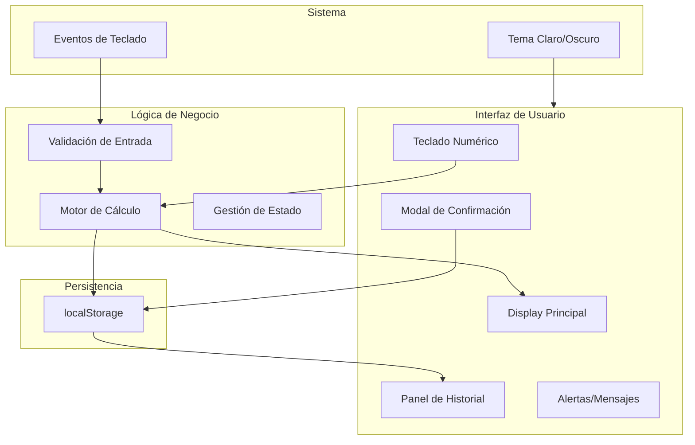
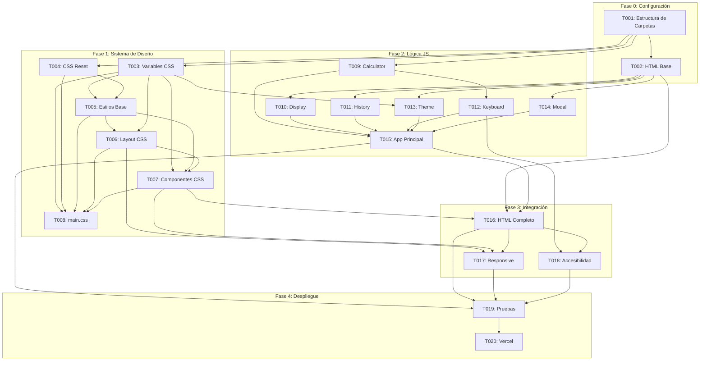

# Plan de Ejecución - Calculadora Científica MVP
## Fragmentación para Desarrollo con IA

---

## Información del Documento

| Campo | Valor |
|-------|-------|
| Fecha de Creación | 2026-01-11 |
| Versión | 1.0 |
| Documento Base | Plan_Maestro_Definitivo.md |
| Alcance | Fase 1 - MVP |

---

# ÍNDICE

- [1. Estructura de Carpetas](#1-estructura-de-carpetas)
- [2. Mapa de Componentes](#2-mapa-de-componentes)
- [3. Índice de Tareas](#3-índice-de-tareas)
- [4. Diagrama de Dependencias](#4-diagrama-de-dependencias)
- [5. Orden de Ejecución](#5-orden-de-ejecución)
- [6. Estimación de Complejidad](#6-estimación-de-complejidad)

---

# 1. Estructura de Carpetas

```
04_CALCULADORA_CIENTIFICA/
├── 📄 Plan_Maestro_Definitivo.md          # Documentación de planeación
├── 📄 07_PLAN_EJECUCION.md                # Este documento
├── 📂 _Planeacion_Archivos_Origen/        # Archivos de planeación originales
│
└── 📂 src/                                # Código fuente del proyecto
    ├── 📄 index.html                      # Página principal (SPA)
    ├── 📂 css/
    │   ├── 📄 variables.css               # Variables CSS (tokens de diseño)
    │   ├── 📄 reset.css                   # CSS Reset
    │   ├── 📄 base.css                    # Estilos base y tipografía
    │   ├── 📄 layout.css                  # Layout y estructura
    │   ├── 📄 components.css              # Componentes UI (botones, cards)
    │   └── 📄 main.css                    # Import consolidado
    │
    ├── 📂 js/
    │   ├── 📄 app.js                      # Punto de entrada, inicialización
    │   ├── 📄 calculator.js               # Lógica de cálculos
    │   ├── 📄 display.js                  # Gestión del display
    │   ├── 📄 keyboard.js                 # Eventos de teclado físico
    │   ├── 📄 history.js                  # Gestión del historial (localStorage)
    │   ├── 📄 theme.js                    # Toggle modo oscuro/claro
    │   └── 📄 modal.js                    # Gestión de modales
    │
    └── 📂 assets/
        └── 📂 icons/                      # Iconos SVG (si se usan locales)
```

## Convenciones de Nombrado

| Tipo | Convención | Ejemplo |
|------|------------|---------|
| **Archivos CSS** | kebab-case, descriptivo | `variables.css`, `layout.css` |
| **Archivos JS** | camelCase para módulos | `calculator.js`, `display.js` |
| **Variables CSS** | `--categoria-propiedad` | `--text-primary`, `--space-4` |
| **Clases CSS** | BEM o kebab-case | `.btn-primary`, `.display-result` |
| **Funciones JS** | camelCase, verbos | `calculateResult()`, `saveToHistory()` |
| **IDs HTML** | camelCase | `displayResult`, `historyPanel` |

---

# 2. Mapa de Componentes

## 2.1 Componentes Identificados



## 2.2 Dependencias entre Componentes

| Componente | Depende de | Es dependencia de |
|------------|-----------|-------------------|
| **variables.css** | - | Todos los CSS |
| **reset.css** | - | base.css |
| **base.css** | variables.css, reset.css | components.css |
| **calculator.js** | - | app.js, display.js |
| **display.js** | - | app.js |
| **history.js** | - | app.js, modal.js |
| **keyboard.js** | calculator.js | app.js |
| **theme.js** | variables.css | app.js |
| **modal.js** | - | app.js |
| **app.js** | Todos los módulos JS | - |

---

# 3. Índice de Tareas

## Fase 0: Configuración Inicial

### T001 - Crear Estructura de Carpetas
| Atributo | Valor |
|----------|-------|
| **ID** | T001 |
| **Descripción** | Crear la estructura de directorios del proyecto según la especificación |
| **Archivos a crear** | `src/`, `src/css/`, `src/js/`, `src/assets/`, `src/assets/icons/` |
| **Dependencias** | Ninguna |
| **Complejidad** | ⭐ (1/5) |
| **Criterios de completitud** | <ul><li>Existen todas las carpetas definidas</li><li>Estructura verificable en explorador de archivos</li></ul> |

---

### T002 - Crear HTML Base
| Atributo | Valor |
|----------|-------|
| **ID** | T002 |
| **Descripción** | Crear el archivo `index.html` con estructura semántica, SEO básico y enlaces a CSS/JS |
| **Archivos a crear** | `src/index.html` |
| **Dependencias** | T001 |
| **Complejidad** | ⭐⭐ (2/5) |
| **Criterios de completitud** | <ul><li>HTML5 válido con doctype</li><li>Meta tags SEO (title, description, viewport)</li><li>Enlaces a Google Fonts (Inter, JetBrains Mono)</li><li>Enlace a main.css</li><li>Enlace a app.js (type="module" o al final del body)</li><li>Estructura de zonas definidas (header, main, footer)</li></ul> |

**Detalle de implementación:**
- Incluir contenedores con IDs para: `calculatorDisplay`, `keypad`, `historyPanel`
- Agregar botón toggle para tema claro/oscuro
- Agregar atributo `data-theme` en `<html>` para modo oscuro

---

## Fase 1: Sistema de Diseño (CSS)

### T003 - Definir Variables CSS
| Atributo | Valor |
|----------|-------|
| **ID** | T003 |
| **Descripción** | Crear archivo `variables.css` con todos los tokens de diseño del Plan Maestro |
| **Archivos a crear** | `src/css/variables.css` |
| **Dependencias** | T001 |
| **Complejidad** | ⭐⭐ (2/5) |
| **Criterios de completitud** | <ul><li>Variables de colores primarios, secundarios, semánticos</li><li>Variables de tipografía (fuentes, tamaños, pesos)</li><li>Variables de espaciado (space-1 a space-16)</li><li>Variables de bordes (radius-sm a radius-full)</li><li>Variables de sombras (shadow-sm a shadow-xl)</li><li>Variables de transiciones</li><li>Bloque completo para modo oscuro `[data-theme="dark"]`</li></ul> |

**Referencia:** Sección D.2.7 del Plan Maestro (Variables CSS Completas)

---

### T004 - Crear CSS Reset
| Atributo | Valor |
|----------|-------|
| **ID** | T004 |
| **Descripción** | Crear archivo de reset CSS para normalizar estilos entre navegadores |
| **Archivos a crear** | `src/css/reset.css` |
| **Dependencias** | T001 |
| **Complejidad** | ⭐ (1/5) |
| **Criterios de completitud** | <ul><li>Box-sizing: border-box global</li><li>Margin y padding removidos por defecto</li><li>Font-family heredada</li><li>Imágenes con display: block</li></ul> |

---

### T005 - Crear Estilos Base
| Atributo | Valor |
|----------|-------|
| **ID** | T005 |
| **Descripción** | Crear archivo `base.css` con tipografía y estilos fundamentales |
| **Archivos a crear** | `src/css/base.css` |
| **Dependencias** | T003, T004 |
| **Complejidad** | ⭐⭐ (2/5) |
| **Criterios de completitud** | <ul><li>Body con fuente Inter, color de texto y fondo del tema</li><li>Estilos base para encabezados</li><li>Transición global para cambio de tema</li><li>Estilos de foco para accesibilidad</li></ul> |

---

### T006 - Crear Layout CSS
| Atributo | Valor |
|----------|-------|
| **ID** | T006 |
| **Descripción** | Crear archivo `layout.css` con la estructura responsiva de la aplicación |
| **Archivos a crear** | `src/css/layout.css` |
| **Dependencias** | T003, T005 |
| **Complejidad** | ⭐⭐⭐ (3/5) |
| **Criterios de completitud** | <ul><li>Layout mobile-first</li><li>Contenedor principal centrado con máx ancho</li><li>Grid/Flexbox para organizar zonas (display, teclado, historial)</li><li>Media queries para desktop (>=768px)</li><li>Historial adaptable (colapsable en móvil, lateral en desktop)</li></ul> |

---

### T007 - Crear Componentes CSS
| Atributo | Valor |
|----------|-------|
| **ID** | T007 |
| **Descripción** | Crear archivo `components.css` con estilos de todos los componentes UI |
| **Archivos a crear** | `src/css/components.css` |
| **Dependencias** | T003, T005, T006 |
| **Complejidad** | ⭐⭐⭐⭐ (4/5) |
| **Criterios de completitud** | <ul><li>**Botones:**<ul><li>`.btn-primary` (igual =)</li><li>`.btn-secondary` (números 0-9)</li><li>`.btn-accent` (operadores +, -, ×, ÷)</li><li>`.btn-critical` (C - limpiar)</li><li>`.btn-auxiliary` (← backspace)</li><li>Estados: default, hover, active, disabled, selected</li></ul></li><li>**Display:**<ul><li>`.display` contenedor</li><li>`.display-operation` (operación en curso)</li><li>`.display-result` (resultado)</li></ul></li><li>**Cards/Historial:**<ul><li>`.card`, `.card-header`</li><li>`.history-item`, `.history-item-operation`, `.history-item-result`</li></ul></li><li>**Modal:**<ul><li>`.modal-overlay`</li><li>`.modal`, `.modal-title`, `.modal-message`, `.modal-actions`</li></ul></li><li>**Alertas:**<ul><li>`.alert-error`, `.alert-success`, `.alert-info`</li></ul></li></ul> |

**Referencia:** Sección D.2.6 del Plan Maestro (Aplicación en Componentes)

---

### T008 - Crear CSS Principal (Import)
| Atributo | Valor |
|----------|-------|
| **ID** | T008 |
| **Descripción** | Crear archivo `main.css` que importe todos los archivos CSS en orden correcto |
| **Archivos a crear** | `src/css/main.css` |
| **Dependencias** | T003, T004, T005, T006, T007 |
| **Complejidad** | ⭐ (1/5) |
| **Criterios de completitud** | <ul><li>Imports en orden: variables → reset → base → layout → components</li><li>Sin estilos adicionales en este archivo</li></ul> |

---

## Fase 2: Lógica JavaScript

### T009 - Crear Módulo Calculator
| Atributo | Valor |
|----------|-------|
| **ID** | T009 |
| **Descripción** | Implementar la lógica core de cálculos matemáticos |
| **Archivos a crear** | `src/js/calculator.js` |
| **Dependencias** | T001 |
| **Complejidad** | ⭐⭐⭐ (3/5) |
| **Criterios de completitud** | <ul><li>Funciones exportadas: `add()`, `subtract()`, `multiply()`, `divide()`</li><li>`calculate(expression)` - evalúa expresión completa</li><li>Manejo de división por cero (retorna error)</li><li>Manejo de precisión decimal (máx 8 decimales)</li><li>No usa `eval()` (implementación segura)</li></ul> |

**Especificación:**
```javascript
// Funciones requeridas
export function add(a, b) { ... }
export function subtract(a, b) { ... }
export function multiply(a, b) { ... }
export function divide(a, b) { ... } // Retorna error si b === 0
export function calculate(num1, operator, num2) { ... }
```

---

### T010 - Crear Módulo Display
| Atributo | Valor |
|----------|-------|
| **ID** | T010 |
| **Descripción** | Implementar gestión del display (mostrar operación, resultado, errores) |
| **Archivos a crear** | `src/js/display.js` |
| **Dependencias** | T002 |
| **Complejidad** | ⭐⭐ (2/5) |
| **Criterios de completitud** | <ul><li>`updateOperation(text)` - actualiza display de operación</li><li>`updateResult(value)` - actualiza display de resultado</li><li>`showError(message)` - muestra mensaje de error</li><li>`clear()` - limpia ambos displays</li><li>Manejo de overflow (truncar o reducir fuente)</li></ul> |

---

### T011 - Crear Módulo History
| Atributo | Valor |
|----------|-------|
| **ID** | T011 |
| **Descripción** | Implementar persistencia del historial con localStorage |
| **Archivos a crear** | `src/js/history.js` |
| **Dependencias** | T002 |
| **Complejidad** | ⭐⭐⭐ (3/5) |
| **Criterios de completitud** | <ul><li>`saveOperation(operation, result)` - guarda en localStorage</li><li>`getHistory()` - retorna array de operaciones</li><li>`clearHistory()` - elimina todo el historial</li><li>`renderHistory()` - actualiza UI del panel</li><li>Límite máximo de 50 entradas (FIFO)</li><li>Formato de entrada: `{ operation: "5 + 3", result: "8", timestamp: ... }`</li></ul> |

---

### T012 - Crear Módulo Keyboard
| Atributo | Valor |
|----------|-------|
| **ID** | T012 |
| **Descripción** | Implementar soporte para teclado físico |
| **Archivos a crear** | `src/js/keyboard.js` |
| **Dependencias** | T009 |
| **Complejidad** | ⭐⭐ (2/5) |
| **Criterios de completitud** | <ul><li>Mapeo de teclas según Plan Maestro D.1.4:</li><li>`0-9`, `Numpad0-9` → números</li><li>`+`, `Shift+=` → suma</li><li>`-` → resta</li><li>`*`, `x`, `X` → multiplicación</li><li>`/` → división</li><li>`Enter`, `=` → ejecutar cálculo</li><li>`Escape`, `Delete` → limpiar</li><li>`Backspace` → borrar último dígito</li><li>Evento `keydown` global con prevención de defaults</li></ul> |

---

### T013 - Crear Módulo Theme
| Atributo | Valor |
|----------|-------|
| **ID** | T013 |
| **Descripción** | Implementar toggle de modo claro/oscuro |
| **Archivos a crear** | `src/js/theme.js` |
| **Dependencias** | T002, T003 |
| **Complejidad** | ⭐⭐ (2/5) |
| **Criterios de completitud** | <ul><li>`toggleTheme()` - alterna entre claro y oscuro</li><li>`initTheme()` - detecta preferencia del sistema y localStorage</li><li>Guarda preferencia en localStorage</li><li>Actualiza atributo `data-theme` en `<html>`</li><li>Actualiza icono del botón toggle (sol/luna)</li></ul> |

---

### T014 - Crear Módulo Modal
| Atributo | Valor |
|----------|-------|
| **ID** | T014 |
| **Descripción** | Implementar sistema de modales (confirmación de borrado) |
| **Archivos a crear** | `src/js/modal.js` |
| **Dependencias** | T002 |
| **Complejidad** | ⭐⭐ (2/5) |
| **Criterios de completitud** | <ul><li>`showConfirmModal(title, message, onConfirm, onCancel)` - modal genérico</li><li>`showDeleteHistoryModal(onConfirm)` - modal específico de borrado</li><li>Cierre con click fuera del modal</li><li>Cierre con tecla Escape</li><li>Foco atrapado dentro del modal (accesibilidad)</li></ul> |

---

### T015 - Crear App Principal
| Atributo | Valor |
|----------|-------|
| **ID** | T015 |
| **Descripción** | Crear punto de entrada que integra todos los módulos |
| **Archivos a crear** | `src/js/app.js` |
| **Dependencias** | T009, T010, T011, T012, T013, T014 |
| **Complejidad** | ⭐⭐⭐⭐ (4/5) |
| **Criterios de completitud** | <ul><li>Importa todos los módulos</li><li>`init()` - inicializa la aplicación</li><li>Gestión de estado de la calculadora:<ul><li>`currentNumber`</li><li>`previousNumber`</li><li>`operator`</li><li>`shouldResetDisplay`</li></ul></li><li>Event listeners para todos los botones del teclado visual</li><li>Integración con módulo keyboard</li><li>Flujos implementados:<ul><li>Happy Path (cálculo básico)</li><li>Encadenamiento de operaciones</li><li>Manejo de errores</li></ul></li><li>Estado inicial correcto al cargar</li></ul> |

---

## Fase 3: Integración y Pulido

### T016 - Implementar HTML Completo
| Atributo | Valor |
|----------|-------|
| **ID** | T016 |
| **Descripción** | Completar el HTML con todos los elementos del teclado y componentes |
| **Archivos a modificar** | `src/index.html` |
| **Dependencias** | T002, T007, T015 |
| **Complejidad** | ⭐⭐⭐ (3/5) |
| **Criterios de completitud** | <ul><li>Display completo (operación + resultado)</li><li>Teclado numérico completo (0-9, punto decimal)</li><li>Botones de operación (+, -, ×, ÷)</li><li>Botón igual (=) con clase primaria</li><li>Botón limpiar (C) con clase crítica</li><li>Botón backspace (←)</li><li>Panel de historial con estructura</li><li>Botón toggle tema</li><li>Modal de confirmación oculto por defecto</li><li>IDs y clases consistentes con JS</li></ul> |

---

### T017 - Implementar Responsive Design
| Atributo | Valor |
|----------|-------|
| **ID** | T017 |
| **Descripción** | Verificar y ajustar comportamiento responsivo en móvil y desktop |
| **Archivos a modificar** | `src/css/layout.css`, `src/css/components.css` |
| **Dependencias** | T006, T007, T016 |
| **Complejidad** | ⭐⭐ (2/5) |
| **Criterios de completitud** | <ul><li>Teclado legible y usable en móvil (botones suficientemente grandes)</li><li>Display visible sin scroll horizontal</li><li>Historial accesible (colapsable en móvil)</li><li>Probado en viewport 360px (móvil) y 1024px (desktop)</li></ul> |

---

### T018 - Implementar Accesibilidad Básica
| Atributo | Valor |
|----------|-------|
| **ID** | T018 |
| **Descripción** | Asegurar accesibilidad básica (navegación por teclado, atributos ARIA) |
| **Archivos a modificar** | `src/index.html`, `src/js/keyboard.js` |
| **Dependencias** | T012, T016 |
| **Complejidad** | ⭐⭐ (2/5) |
| **Criterios de completitud** | <ul><li>Todos los botones navegables con Tab</li><li>Indicadores de foco visibles</li><li>Atributos `aria-label` en botones de iconos</li><li>Rol y aria-live para display (lectores de pantalla)</li><li>`lang="es"` en HTML</li></ul> |

---

## Fase 4: Pruebas y Despliegue

### T019 - Pruebas Funcionales
| Atributo | Valor |
|----------|-------|
| **ID** | T019 |
| **Descripción** | Ejecutar pruebas manuales de todos los flujos |
| **Archivos a crear** | N/A (documentar resultados) |
| **Dependencias** | T015, T016, T017, T018 |
| **Complejidad** | ⭐⭐⭐ (3/5) |
| **Criterios de completitud** | <ul><li>**Flujo Happy Path:** 5 + 3 = 8 ✓</li><li>**Operaciones:** +, -, ×, ÷ funcionan correctamente</li><li>**División por cero:** Muestra error apropiado</li><li>**Encadenamiento:** 8 × 2 = 16 (continuar con resultado anterior)</li><li>**Historial:** Se guarda y muestra correctamente</li><li>**Borrar historial:** Modal de confirmación funciona</li><li>**Teclado físico:** Todas las teclas mapeadas funcionan</li><li>**Tema:** Toggle claro/oscuro funciona y persiste</li><li>**Responsive:** Verificado en móvil y desktop</li></ul> |

---

### T020 - Configurar Despliegue Vercel
| Atributo | Valor |
|----------|-------|
| **ID** | T020 |
| **Descripción** | Preparar y desplegar el proyecto en Vercel |
| **Archivos a crear** | `vercel.json` (opcional) |
| **Dependencias** | T019 |
| **Complejidad** | ⭐⭐ (2/5) |
| **Criterios de completitud** | <ul><li>Repositorio GitHub conectado</li><li>`src/` configurado como directorio raíz</li><li>URL de producción funcional (*.vercel.app)</li><li>Vista previa accesible</li></ul> |

---

# 4. Diagrama de Dependencias



---

# 5. Orden de Ejecución

## 5.1 Ejecución Secuencial Recomendada

| Orden | ID | Tarea | Bloquea |
|-------|-----|-------|---------|
| 1 | T001 | Estructura de Carpetas | T002, T003, T004, T009 |
| 2 | T002 | HTML Base | T010, T011, T013, T014, T016 |
| 3 | T003 | Variables CSS | T005, T006, T007, T013 |
| 4 | T004 | CSS Reset | T005 |
| 5 | T005 | Estilos Base | T006, T007 |
| 6 | T006 | Layout CSS | T007, T017 |
| 7 | T007 | Componentes CSS | T008, T016, T017 |
| 8 | T008 | main.css | - |
| 9 | T009 | Calculator | T012, T015 |
| 10 | T010 | Display | T015 |
| 11 | T011 | History | T015 |
| 12 | T012 | Keyboard | T015, T018 |
| 13 | T013 | Theme | T015 |
| 14 | T014 | Modal | T015 |
| 15 | T015 | App Principal | T016 |
| 16 | T016 | HTML Completo | T017, T018, T019 |
| 17 | T017 | Responsive | T019 |
| 18 | T018 | Accesibilidad | T019 |
| 19 | T019 | Pruebas Funcionales | T020 |
| 20 | T020 | Despliegue Vercel | - |

## 5.2 Tareas Paralelizables

Las siguientes tareas pueden ejecutarse en paralelo si hay múltiples agentes disponibles:

| Grupo Paralelo | Tareas | Requisito Previo |
|----------------|--------|------------------|
| **Grupo A** | T003, T004 | T001 completada |
| **Grupo B** | T009, T010, T011, T013, T014 | T001 + T002 completadas |
| **Grupo C** | T017, T018 | T016 completada |

---

# 6. Estimación de Complejidad

## 6.1 Resumen por Complejidad

| Complejidad | Cantidad | Tareas |
|-------------|----------|--------|
| ⭐ (1/5) Trivial | 3 | T001, T004, T008 |
| ⭐⭐ (2/5) Simple | 9 | T002, T003, T005, T010, T012, T013, T014, T017, T018, T020 |
| ⭐⭐⭐ (3/5) Moderada | 5 | T006, T009, T011, T016, T019 |
| ⭐⭐⭐⭐ (4/5) Compleja | 2 | T007, T015 |
| ⭐⭐⭐⭐⭐ (5/5) Muy Compleja | 0 | - |

## 6.2 Estimación de Tiempo

| Complejidad | Tiempo Estimado por Tarea | Total |
|-------------|---------------------------|-------|
| ⭐ (1/5) | ~15 min | 45 min |
| ⭐⭐ (2/5) | ~30 min | 4.5 hrs |
| ⭐⭐⭐ (3/5) | ~1 hr | 5 hrs |
| ⭐⭐⭐⭐ (4/5) | ~2 hrs | 4 hrs |
| **TOTAL** | - | **~14 horas** |

> ⚠️ **Nota**: Estimación para ejecución con IA. Incluye tiempo de revisión y ajustes menores. No incluye tiempo de decisiones humanas pendientes.

## 6.3 Decisiones Humanas Requeridas

Antes de iniciar la ejecución, se recomienda resolver las siguientes decisiones pendientes del Plan Maestro (Sección D.1.6):

| ID | Pregunta | Impacta a Tarea |
|----|----------|-----------------|
| DH-01 | ¿Ignorar operador sin número o usar "0" implícito? | T009, T015 |
| DH-02 | ¿Cómo activar historial en móvil? | T016 |
| DH-03 | ¿Cuántas operaciones mostrar en pantalla? | T011 |
| DH-04 | ¿Longitud máxima de caracteres en display? | T010 |
| DH-05 | ¿Usar separador de miles? | T010 |
| DH-06 | ¿Cuántos decimales máximo? | T009 |
| DH-07 | ¿Posición del panel de historial? | T006, T016 |
| DH-08 | ¿Mostrar alerta de éxito? | T015 |
| DH-09 | ¿Qué hacer al presionar = múltiples veces? | T015 |
| DH-10 | ¿Máximo de entradas en localStorage? | T011 |

---

## Control de Cambios

| Fecha | Versión | Cambio | Autor |
|-------|---------|--------|-------|
| 2026-01-11 | 1.0 | Creación inicial del documento | IA |
