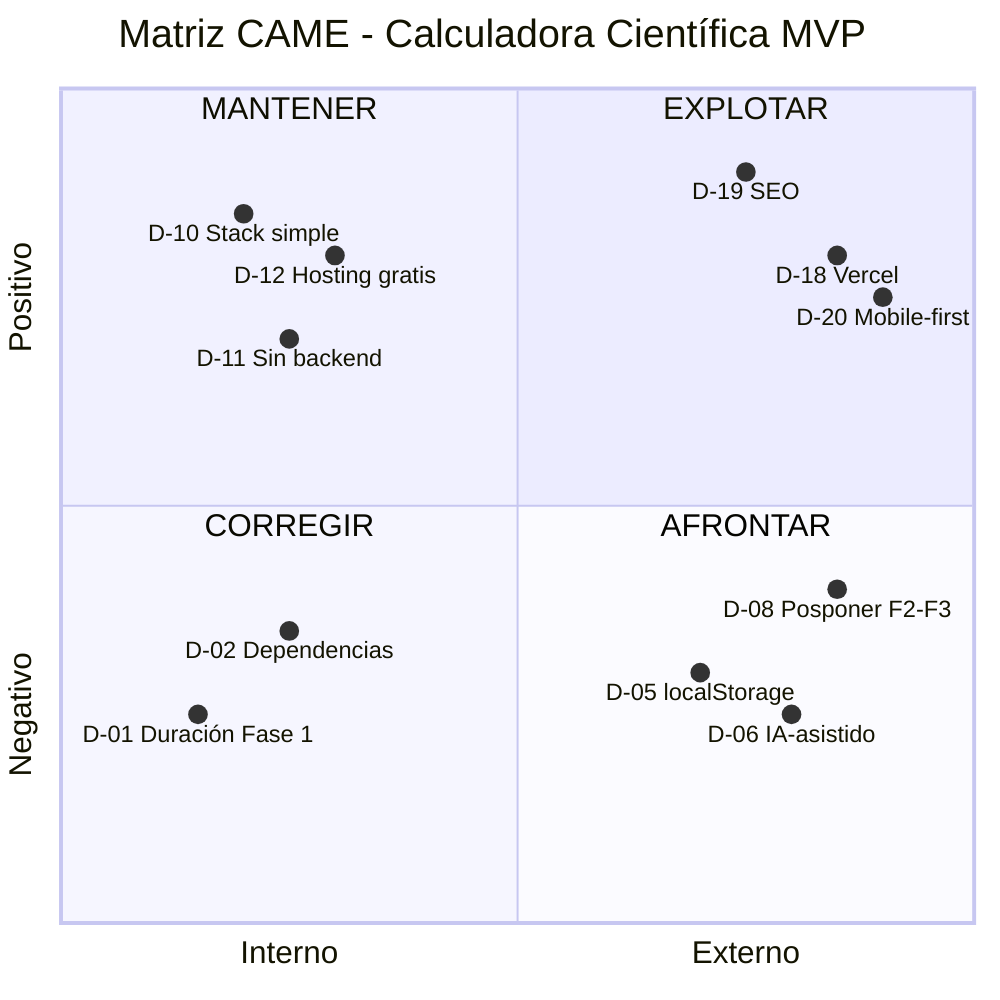

# Plan Maestro Definitivo
## Calculadora Científica en Línea - MVP

---

## Información del Documento
| Campo | Valor |
|-------|-------|
| Fecha de Consolidación | 2026-01-11 |
| Versión | 1.0 |
| Documentos Origen | 01_IDEAS_CONSOLIDADO.md, 02_MASTER_PLAN.md, 03_RIESGOS_OPORTUNIDADES.md, 04_DECISIONES_CAME.md, 05_UI_UX.md, 06_IDENTIDAD_VISUAL.md |
| Estado | Consolidado |

---

# ÍNDICE

## SECCIÓN A: FUNDAMENTOS
- [A.1 Introducción y Objetivo del Proyecto](#a1-introducción-y-objetivo-del-proyecto)
- [A.2 Alcance del MVP](#a2-alcance-del-mvp)
- [A.3 Ideas y Contexto Inicial](#a3-ideas-y-contexto-inicial)

## SECCIÓN B: CONTEXTO TÉCNICO
- [B.1 Contexto Técnico del Usuario](#b1-contexto-técnico-del-usuario)
- [B.2 Recursos Técnicos Disponibles](#b2-recursos-técnicos-disponibles)
- [B.3 Selección Tecnológica](#b3-selección-tecnológica)

## SECCIÓN C: ANÁLISIS ESTRATÉGICO
- [C.1 Riesgos Identificados](#c1-riesgos-identificados)
- [C.2 Oportunidades Identificadas](#c2-oportunidades-identificadas)
- [C.3 Decisiones Estratégicas CAME](#c3-decisiones-estratégicas-came)

## SECCIÓN D: DISEÑO
- [D.1 Diseño UX/UI Funcional](#d1-diseño-uxui-funcional)
- [D.2 Identidad Visual](#d2-identidad-visual)

## SECCIÓN E: LÍMITES Y EJECUCIÓN
- [E.1 Plan de Ejecución (Fases)](#e1-plan-de-ejecución-fases)
- [E.2 Requisitos Derivados](#e2-requisitos-derivados)
- [E.3 Límites y Exclusiones del Proyecto](#e3-límites-y-exclusiones-del-proyecto)

---

# SECCIÓN A: FUNDAMENTOS

---

## A.1 Introducción y Objetivo del Proyecto

### Visión del Proyecto
Crear una herramienta en línea para realizar cálculos de manera accesible y fácil de usar, que evolucione desde funciones básicas hasta capacidades científicas y de graficación.

### Intención del Proyecto
> Crear una herramienta en línea para realizar cálculos de manera accesible y fácil de usar.

### Tipo de Software
| Campo | Valor |
|-------|-------|
| **Tipo** | 🌐 Página Web |
| **Descripción** | Sitio informativo, landing page, portafolio |
| **Plataforma** | Navegador web (desktop y móvil) |

### Objetivo Principal
> Desarrollar una calculadora básica funcional con una interfaz intuitiva que permita realizar operaciones matemáticas fundamentales y conservar un historial de cálculos.

### Objetivos Específicos
1. **O1**: Implementar operaciones básicas (suma, resta, multiplicación, división)
2. **O2**: Diseñar una interfaz de usuario accesible y atractiva
3. **O3**: Integrar sistema de historial de cálculos
4. **O4**: Garantizar compatibilidad con dispositivos móviles y escritorio

---

## A.2 Alcance del MVP

### Incluido en MVP (Fase 1)
- ✅ Calculadora básica con operaciones fundamentales (suma, resta, multiplicación, división)
- ✅ Interfaz de usuario intuitiva y responsiva (HTML/CSS/JS)
- ✅ Historial de cálculos realizados (localStorage)
- ✅ Diseño web optimizado para SEO

> 📋 **[ANOTACIÓN DE CONTEXTO]**: El usuario indica preferencia por servicios gratuitos. Las tecnologías seleccionadas (HTML/CSS/JS + localStorage) son compatibles con esta restricción.

### Fuera del MVP (Fases Posteriores)
- ⏳ Calculadora científica (integrales, derivadas, ecuaciones)
- ⏳ Calculadora gráfica (visualización de funciones)
- ⏳ Soporte para conversión de unidades
- ⏳ Calculadora de propina para varios países

---

## A.3 Ideas y Contexto Inicial

### Información del Proyecto
| Campo | Valor |
|-------|-------|
| Fecha de Creación | 2026-01-11 |
| Última Actualización | 2026-01-11 |
| Total Ideas Seleccionadas | 3 |
| Total Características Seleccionadas | 4 |

### Ideas Centrales Seleccionadas

#### IDEA_1: Calculadora Básica
| Atributo | Valor |
|----------|-------|
| **Descripción** | Desarrollar una calculadora con funciones básicas como suma, resta, multiplicación y división |
| **Tipo** | Funcionalidad |
| **Prioridad** | 🔴 Alta |

#### IDEA_2: Calculadora Científica
| Atributo | Valor |
|----------|-------|
| **Descripción** | Incluir funciones científicas como cálculo de integrales, derivadas, ecuaciones y más |
| **Tipo** | Funcionalidad |
| **Prioridad** | 🟡 Media |

#### IDEA_3: Calculadora Gráfica
| Atributo | Valor |
|----------|-------|
| **Descripción** | Permitir la graficación de funciones y ecuaciones para visualizar los resultados |
| **Tipo** | Funcionalidad |
| **Prioridad** | 🟡 Media |

### Características Seleccionadas

#### CARACTERÍSTICA_1: Interfaz de Usuario
| Atributo | Valor |
|----------|-------|
| **Descripción** | Diseñar una interfaz de usuario intuitiva y fácil de usar para la calculadora |
| **Relacionada con** | General (todas las ideas) |
| **Prioridad** | 🔴 Alta |

#### CARACTERÍSTICA_2: Historial de Cálculos
| Atributo | Valor |
|----------|-------|
| **Descripción** | Incluir la capacidad de guardar y visualizar el historial de cálculos realizados |
| **Relacionada con** | IDEA_1 (Calculadora Básica) |
| **Prioridad** | 🟡 Media |

#### CARACTERÍSTICA_3: Soporte para Unidades
| Atributo | Valor |
|----------|-------|
| **Descripción** | Permitir la entrada y conversión de unidades para los cálculos |
| **Relacionada con** | IDEA_1 (Calculadora Básica) |
| **Prioridad** | 🟢 Baja |

#### CARACTERÍSTICA_4: Calculadora de Propina
| Atributo | Valor |
|----------|-------|
| **Descripción** | Incluir la capacidad de calcular la propina para diferentes países y culturas |
| **Relacionada con** | IDEA_1 (Calculadora Básica) |
| **Prioridad** | 🟢 Baja |

---

# SECCIÓN B: CONTEXTO TÉCNICO

---

> ⚠️ **NOTA**: Esta sección documenta CONTEXTO proporcionado por el usuario, no constituye decisiones técnicas ni prescripciones.

## B.1 Contexto Técnico del Usuario

### Nivel Técnico del Usuario
- **Nivel**: Básico - Principiante
- **Descripción**: Necesita guía completa durante todo el proceso de desarrollo

### Rol en el Desarrollo
- **Rol**: Orquestador de IA
- **Descripción**: La IA escribe el código, el usuario dirige y supervisa

---

## B.2 Recursos Técnicos Disponibles

| Recurso | Estado | Observaciones |
|---------|--------|---------------|
| **Presupuesto** | $0 MXN | Limitado a opciones sin costo |
| **Máquina Virtual** | Disponible | Sin especificación de proveedor o características |
| **Servicios Preferidos** | Solo gratuitos | Restricción aplicable a hosting, herramientas y APIs |

---

## B.3 Selección Tecnológica

### B.3.1 Stack Tecnológico Seleccionado

#### Frontend
| Tecnología | Versión/Detalle | Justificación |
|------------|-----------------|---------------|
| **HTML5** | Estándar actual | Estructura semántica, soporte universal, SEO-friendly |
| **CSS3** | Con CSS Variables | Diseño responsivo mobile-first, sin preprocesadores para simplificar |
| **JavaScript** | ES6+ Vanilla | Sin frameworks = menor complejidad, sin bundlers, compatible con nivel técnico del usuario |

#### Persistencia
| Tecnología | Justificación |
|------------|---------------|
| **localStorage** | Solución nativa del navegador, sin costo, suficiente para historial local |

#### Hosting y Despliegue
| Servicio | Justificación |
|----------|---------------|
| **Vercel** (Principal) | Plan gratuito, CI/CD automático, previews por PR, dominio gratuito `*.vercel.app` |
| **GitHub Pages** (Alternativa) | Backup si Vercel presenta limitaciones |

> 📋 **[ANOTACIÓN DE CONTEXTO]**: Las opciones de despliegue listadas son compatibles con la restricción de presupuesto $0 MXN reportada por el usuario. Todas ofrecen planes gratuitos para sitios estáticos.

#### Control de Versiones
| Herramienta | Justificación |
|-------------|---------------|
| **Git** | Estándar de la industria, trazabilidad completa |
| **GitHub** | Repositorio gratuito, integración con Vercel, documentación en mismo lugar |

#### Desarrollo Local
| Herramienta | Justificación |
|-------------|---------------|
| **VS Code** | Editor gratuito, extensiones útiles, integración Git |
| **Live Server** (extensión) | Recarga automática, sin configuración |

### B.3.2 Lo que NO se incluye (y por qué)

| Tecnología | Razón de exclusión |
|------------|-------------------|
| React/Vue/Angular | Complejidad innecesaria para MVP + curva de aprendizaje |
| Node.js/Backend | Sin requisito funcional que lo justifique |
| Base de datos | localStorage suficiente; BD requerida solo en Fase 3 |
| TypeScript | Sobrecarga para proyecto simple |
| Sass/Less | CSS Vanilla suficiente para alcance actual |
| Testing frameworks | Validación manual suficiente para MVP |

---

# SECCIÓN C: ANÁLISIS ESTRATÉGICO

---

> **Referencia**: Análisis basado en ISO 9001:2015 (6.1) aplicado a 02_MASTER_PLAN.md v1.3

## C.1 Riesgos Identificados

### R-01: Capacidad técnica limitada del usuario
- **Descripción**: El usuario presenta un nivel técnico básico-principiante y requiere guía completa durante todo el proceso de desarrollo.
- **Origen**: Sección "Contexto Técnico del Usuario" → "Nivel Técnico del Usuario".

### R-02: Dependencia total de la IA para la generación de código
- **Descripción**: El usuario actúa exclusivamente como orquestador, delegando toda la escritura de código a la IA. Esto genera dependencia técnica para cualquier modificación, corrección o mantenimiento del sistema.
- **Origen**: Sección "Contexto Técnico del Usuario" → "Rol en el Desarrollo".

### R-03: Presupuesto nulo para el proyecto
- **Descripción**: El proyecto cuenta con $0 MXN de presupuesto, limitando las opciones a servicios y herramientas exclusivamente gratuitos.
- **Origen**: Sección "Contexto Técnico del Usuario" → "Recursos Técnicos Disponibles".

### R-04: Restricción a servicios gratuitos únicamente
- **Descripción**: Existe una restricción explícita a utilizar solo servicios sin costo, lo cual aplica a hosting, herramientas y APIs.
- **Origen**: Sección "Contexto Técnico del Usuario" → "Recursos Técnicos Disponibles" y Anotación de Contexto en "Dependencias y Restricciones".

### R-05: Máquina virtual sin especificaciones definidas
- **Descripción**: Se reporta disponibilidad de una máquina virtual, pero no se especifican características técnicas (proveedor, capacidad, sistema operativo, conectividad).
- **Origen**: Sección "Contexto Técnico del Usuario" → "Recursos Técnicos Disponibles" y Anotación de Contexto en "Dependencias Técnicas".

### R-06: Duraciones de fase no definidas
- **Descripción**: Las tres fases de ejecución (Fase 1: MVP, Fase 2: Calculadora Científica, Fase 3: Gráfica + Conversión) tienen "Duración Estimada: Por definir", lo que impide la planificación temporal del proyecto.
- **Origen**: Sección "Fases de Ejecución" → Tablas de cada fase.

### R-07: Dependencias técnicas no identificadas
- **Descripción**: La sección de dependencias técnicas permanece vacía con la indicación "Por definir en fase de análisis técnico", dejando incertidumbre sobre requisitos externos.
- **Origen**: Sección "Dependencias y Restricciones" → "Dependencias Técnicas".

### R-08: Restricciones del proyecto no formalizadas
- **Descripción**: Las restricciones generales del proyecto figuran como "Por definir según contexto técnico del usuario", existiendo solo como anotaciones de contexto.
- **Origen**: Sección "Dependencias y Restricciones" → "Restricciones".

### R-09: Persistencia de datos limitada a localStorage
- **Descripción**: El historial de cálculos se almacenará exclusivamente en localStorage del navegador, lo que implica pérdida de datos si el usuario limpia el navegador o cambia de dispositivo.
- **Origen**: Sección "Alcance del MVP" y "Stack Tecnológico Recomendado".

### R-10: Ausencia de mecanismo de sincronización entre dispositivos
- **Descripción**: Al utilizar únicamente localStorage, no existe forma de mantener el historial consistente entre diferentes dispositivos o navegadores del mismo usuario.
- **Origen**: Sección "Stack Tecnológico Recomendado" → "localStorage" como única opción de persistencia.

### R-11: Complejidad incremental significativa entre fases
- **Descripción**: Las fases posteriores (cálculo de derivadas, integrales, graficación de funciones) representan un salto técnico considerable respecto al MVP, requiriendo posiblemente bibliotecas o motores especializados.
- **Origen**: Sección "Fases de Ejecución" → Fase 2 y Fase 3.

### R-12: Requisito de base de datos para conversión de unidades
- **Descripción**: La Fase 3 incluye la creación de "Base de datos de unidades y factores de conversión", lo cual excede las capacidades del stack actual basado en localStorage.
- **Origen**: Sección "Fases de Ejecución" → Fase 3 → "Tareas Principales".

### R-13: Funcionalidad de propina requiere datos multi-país
- **Descripción**: La calculadora de propina con soporte multi-país (RF-07) requiere información cultural y legislativa de diversos países, sin especificar la fuente de estos datos.
- **Origen**: Sección "Requisitos Funcionales" → RF-07 y Sección "Fases de Ejecución" → Fase 3.

---

## C.2 Oportunidades Identificadas

### O-01: Stack tecnológico simple y accesible
- **Descripción**: El uso de HTML5, CSS3 y JavaScript Vanilla representa una curva de aprendizaje reducida y amplia compatibilidad con recursos educativos disponibles.
- **Origen**: Sección "Stack Tecnológico Recomendado" → "Frontend".

### O-02: Independencia de backend para el MVP
- **Descripción**: El MVP no requiere infraestructura de servidor, permitiendo desarrollo y despliegue como sitio completamente estático.
- **Origen**: Sección "Stack Tecnológico Recomendado" y "Alcance del MVP".

### O-03: Múltiples opciones de hosting gratuito
- **Descripción**: Existen tres plataformas de despliegue identificadas (GitHub Pages, Netlify, Vercel) que ofrecen planes gratuitos compatibles con las restricciones del proyecto.
- **Origen**: Sección "Stack Tecnológico Recomendado" → "Despliegue" y Anotación de Contexto asociada.

### O-04: Compatibilidad con flujos CI/CD sin costo
- **Descripción**: Las plataformas Netlify y Vercel incluyen integración continua y despliegue continuo de forma gratuita.
- **Origen**: Sección "Stack Tecnológico Recomendado" → "Despliegue".

### O-05: Previsualizaciones automáticas de cambios
- **Descripción**: Vercel ofrece previews automáticos, facilitando la revisión de modificaciones antes del despliegue a producción.
- **Origen**: Sección "Stack Tecnológico Recomendado" → "Despliegue" → Vercel.

### O-06: Infraestructura de desarrollo estándar y gratuita
- **Descripción**: Las herramientas de desarrollo especificadas (VS Code, Live Server, Git/GitHub) son estándar de la industria, gratuitas y ampliamente documentadas.
- **Origen**: Sección "Stack Tecnológico Recomendado" → "Herramientas de Desarrollo".

### O-07: Control de versiones integrado desde el inicio
- **Descripción**: La inclusión de Git/GitHub desde el diseño inicial permite trazabilidad del código y facilita colaboración futura.
- **Origen**: Sección "Stack Tecnológico Recomendado" → "Herramientas de Desarrollo".

### O-08: Diseño optimizado para SEO como requisito
- **Descripción**: El MVP incluye explícitamente la optimización para motores de búsqueda, potenciando la visibilidad orgánica del proyecto.
- **Origen**: Sección "Alcance del MVP" → "Incluido en MVP".

### O-09: Enfoque mobile-first implícito
- **Descripción**: Los requisitos RNF-01 y RNF-02 establecen interfaz responsiva para móvil y escritorio como prioridad alta, alineándose con patrones de uso actuales.
- **Origen**: Sección "Requisitos No Funcionales".

### O-10: Disponibilidad de máquina virtual para pruebas
- **Descripción**: Existe una máquina virtual disponible que podría utilizarse para entornos de desarrollo o pruebas sin costos adicionales.
- **Origen**: Sección "Contexto Técnico del Usuario" → "Recursos Técnicos Disponibles".

### O-11: Modelo de desarrollo escalable por fases
- **Descripción**: La estructura de tres fases permite entregas incrementales, validando el producto desde el MVP antes de invertir esfuerzo en funcionalidades avanzadas.
- **Origen**: Sección "Fases de Ejecución".

### O-12: Priorización clara de requisitos
- **Descripción**: Los requisitos funcionales y no funcionales están clasificados por prioridad (Alta, Media, Baja), facilitando la toma de decisiones de alcance.
- **Origen**: Sección "Requisitos Funcionales" y "Requisitos No Funcionales".

### O-13: Trazabilidad de requisitos a ideas origen
- **Descripción**: Cada requisito funcional está vinculado a su idea o característica de origen (IDEA_1, CARACTERÍSTICA_2, etc.), permitiendo rastrear la justificación de cada función.
- **Origen**: Sección "Requisitos Derivados" → Columna "Origen".

### O-14: Ejecutabilidad en tiempo real sin latencia de red
- **Descripción**: Los cálculos se ejecutan localmente en el navegador (RNF-03), eliminando dependencia de conectividad para la funcionalidad core.
- **Origen**: Sección "Requisitos No Funcionales" → RNF-03.

---

## C.3 Decisiones Estratégicas CAME

> **Metodología**: CAME (Corregir, Afrontar, Mantener, Explotar)

### C.3.1 CORREGIR (Debilidades internas a eliminar/mitigar)

| # | Decisión | Riesgo/Oportunidad | Tipo |
|---|----------|-------------------|------|
| D-01 | **Definir duración de Fase 1 como 2 semanas** dado el alcance limitado del MVP | R-06 | CORREGIR |
| D-02 | **Formalizar dependencias técnicas**: Solo navegador web moderno (Chrome, Firefox, Edge, Safari) | R-07 | CORREGIR |
| D-03 | **Documentar restricciones del proyecto**: Presupuesto $0, solo servicios gratuitos, código generado por IA | R-08 | CORREGIR |
| D-04 | **Documentar especificaciones de VM**: Solicitar al usuario clarificar proveedor y características si decide usarla | R-05 | CORREGIR |

### C.3.2 AFRONTAR (Amenazas externas a gestionar)

| # | Decisión | Riesgo/Oportunidad | Tipo |
|---|----------|-------------------|------|
| D-05 | **Aceptar limitación de localStorage** como solución de persistencia para MVP; sincronización entre dispositivos queda fuera de alcance | R-09, R-10 | AFRONTAR |
| D-06 | **Adoptar modelo IA-asistido** donde la IA genera 100% del código y el usuario supervisa/valida | R-01, R-02 | AFRONTAR |
| D-07 | **Restringir stack a opciones 100% gratuitas** sin excepciones | R-03, R-04 | AFRONTAR |
| D-08 | **Posponer fases 2 y 3** hasta validar MVP; no evaluar bibliotecas de gráficos ni bases de datos todavía | R-11, R-12 | AFRONTAR |
| D-09 | **Excluir funcionalidad de propina multi-país** del roadmap hasta definir fuente de datos | R-13 | AFRONTAR |

### C.3.3 MANTENER (Fortalezas a preservar)

| # | Decisión | Riesgo/Oportunidad | Tipo |
|---|----------|-------------------|------|
| D-10 | **Conservar stack HTML5/CSS3/JS Vanilla** sin frameworks adicionales | O-01 | MANTENER |
| D-11 | **Mantener arquitectura 100% frontend** sin backend para el MVP | O-02 | MANTENER |
| D-12 | **Preservar opciones de hosting gratuito** (GitHub Pages, Netlify, Vercel) | O-03 | MANTENER |
| D-13 | **Utilizar herramientas de desarrollo estándar** (VS Code, Live Server, Git/GitHub) | O-06, O-07 | MANTENER |
| D-14 | **Respetar priorización de requisitos** definida en Plan Maestro | O-12 | MANTENER |
| D-15 | **Mantener trazabilidad** requisitos → ideas origen | O-13 | MANTENER |
| D-16 | **Preservar modelo de desarrollo por fases** con entregas incrementales | O-11 | MANTENER |
| D-17 | **Garantizar ejecución de cálculos en cliente** sin dependencia de red | O-14 | MANTENER |

### C.3.4 EXPLOTAR (Ventajas a maximizar)

| # | Decisión | Riesgo/Oportunidad | Tipo |
|---|----------|-------------------|------|
| D-18 | **Seleccionar Vercel como plataforma de hosting** por previews automáticos y mejor DX | O-05, O-04 | EXPLOTAR |
| D-19 | **Implementar SEO desde el inicio** con meta tags, semántica HTML5 y estructura optimizada | O-08 | EXPLOTAR |
| D-20 | **Priorizar diseño mobile-first** en CSS | O-09 | EXPLOTAR |
| D-21 | **Reservar VM para entorno de pruebas** en caso de requerirse validación adicional | O-10 | EXPLOTAR |

### C.3.5 Alcance de las Decisiones

#### ✅ Lo que ESTÁ decidido

1. **Lenguajes y tecnologías**: HTML5, CSS3, JavaScript Vanilla ES6+
2. **Persistencia**: localStorage exclusivamente
3. **Hosting**: Vercel (primario), GitHub Pages (respaldo)
4. **Control de versiones**: Git + GitHub
5. **Modelo de desarrollo**: IA genera código, usuario supervisa
6. **Arquitectura**: 100% frontend, sin backend
7. **Enfoque de diseño**: Mobile-first, SEO integrado
8. **Duración Fase 1**: 2 semanas estimadas
9. **Fases 2 y 3**: Pospuestas hasta validar MVP

#### ⏳ Lo que NO está decidido (queda para fases posteriores)

| Elemento | Fase de Decisión |
|----------|------------------|
| Biblioteca de graficación de funciones | Fase 3 |
| Motor matemático para derivadas/integrales | Fase 2 |
| Estructura de base de datos para unidades | Fase 3 |
| Fuente de datos para propina multi-país | Fase 3 |
| Uso específico de la máquina virtual | Cuando se requiera |
| Criterios de aceptación detallados por requisito | Inicio de Fase 1 |

### C.3.6 Matriz CAME Resumen



---

# SECCIÓN D: DISEÑO

---

## D.1 Diseño UX/UI Funcional

> **Alcance**: MVP - Fase 1 (Calculadora Básica)

### D.1.1 Principios de UX del Sistema

#### Reglas Obligatorias de Experiencia de Usuario

| ID | Principio | Descripción | Obligatoriedad |
|----|-----------|-------------|----------------|
| UX-01 | **Claridad de Acción** | Cada elemento interactivo debe comunicar claramente su función sin necesidad de texto adicional | OBLIGATORIO |
| UX-02 | **Retroalimentación Inmediata** | Toda acción del usuario debe generar una respuesta visual en menos de 100ms | OBLIGATORIO |
| UX-03 | **Prevención de Errores** | El sistema debe prevenir errores antes de que ocurran (ej: deshabilitar botones inválidos) | OBLIGATORIO |
| UX-04 | **Recuperación de Errores** | Si ocurre un error, el sistema debe mostrar mensaje claro y opción de recuperación | OBLIGATORIO |
| UX-05 | **Consistencia Visual** | Todos los elementos del mismo tipo deben comportarse y verse de manera idéntica | OBLIGATORIO |
| UX-06 | **Accesibilidad Básica** | El sistema debe ser navegable por teclado y legible en diferentes tamaños | OBLIGATORIO |
| UX-07 | **Estado Visible** | El usuario siempre debe saber en qué estado se encuentra el sistema | OBLIGATORIO |

#### Restricciones Derivadas del Contexto Técnico

> 📋 **[RESTRICCIÓN DE CONTEXTO]**: Usuario con nivel básico-principiante. La interfaz debe minimizar la curva de aprendizaje.

| Restricción | Implicación UX |
|-------------|----------------|
| Usuario principiante | No usar jerga técnica en mensajes de error o etiquetas |
| Presupuesto $0 | No incluir elementos que requieran servicios de pago |
| Ejecución por IA | Toda decisión de comportamiento debe estar explícitamente documentada |

### D.1.2 Estructura de Navegación

#### Arquitectura de Pantallas

```
[PANTALLA ÚNICA - Single Page Application]
├── ZONA: Encabezado
│   └── Título de la aplicación
│   └── (Opcional) Acceso a historial
├── ZONA: Principal
│   ├── Display de operación actual
│   ├── Display de resultado
│   └── Teclado numérico y de operaciones
├── ZONA: Historial
│   └── Lista de operaciones previas (colapsable)
└── ZONA: Pie de página
    └── Información básica / créditos
```

#### Pantalla Inicial (Estado por Defecto)

| Elemento | Estado Inicial | Comportamiento |
|----------|----------------|----------------|
| Display de operación | Vacío o "0" | Texto alineado a la derecha |
| Display de resultado | Oculto o "0" | Se muestra al existir operación |
| Teclado numérico | Todos habilitados | Números 0-9, punto decimal |
| Botones de operación | Todos habilitados | +, -, ×, ÷ |
| Botón igual (=) | Deshabilitado | Se habilita cuando hay operación válida |
| Botón limpiar (C) | Habilitado | Siempre disponible |
| Historial | Vacío o colapsado | Mensaje "Sin operaciones" si vacío |

#### Menú Principal

> ⚠️ **NOTA MVP**: Para el MVP no se requiere menú de navegación tradicional. La aplicación es de pantalla única.

| Componente | Incluido en MVP | Justificación |
|------------|-----------------|---------------|
| Menú hamburguesa | NO | Complejidad innecesaria para calculadora básica |
| Navegación por tabs | NO | Solo hay una funcionalidad principal |
| Acceso a historial | SÍ | Requisito RF-05 y RF-06 |
| Selector de modo | NO | Solo aplica para fases futuras |

#### Submenús

| Submenú | Estado MVP | Descripción |
|---------|------------|-------------|
| Panel de historial | INCLUIDO | Lista desplegable/colapsable de operaciones anteriores |
| Configuración | EXCLUIDO | No hay opciones configurables en MVP |
| Modos de calculadora | EXCLUIDO | Aplica para Fase 2+ |

### D.1.3 Flujos de Usuario

#### Flujo Principal (Happy Path) - Realizar Cálculo Básico

```
INICIO
    │
    ▼
[1] Usuario ve pantalla inicial con display en "0"
    │
    ▼
[2] Usuario presiona número (ej: "5")
    ├── Display muestra: "5"
    ├── Retroalimentación visual: botón presionado
    │
    ▼
[3] Usuario presiona operador (ej: "+")
    ├── Display muestra: "5 +"
    ├── Operador queda visualmente seleccionado
    │
    ▼
[4] Usuario presiona segundo número (ej: "3")
    ├── Display muestra: "5 + 3"
    ├── Botón "=" se habilita
    │
    ▼
[5] Usuario presiona "="
    ├── Display resultado muestra: "8"
    ├── Operación se guarda en historial
    ├── Retroalimentación de éxito
    │
    ▼
[6] Sistema listo para nueva operación
    ├── Usuario puede:
    │   ├── Continuar operando con el resultado
    │   ├── Limpiar e iniciar nueva operación
    │   └── Ver historial de operaciones
    │
    ▼
FIN (Estado: Listo para siguiente operación)
```

#### Flujo de Operación Continua (Encadenamiento)

```
[Precondición: Resultado "8" visible en pantalla]
    │
    ▼
[1] Usuario presiona operador (ej: "×")
    ├── Display muestra: "8 ×"
    ├── Resultado anterior se usa como primer operando
    │
    ▼
[2] Usuario continúa flujo normal desde paso [4] del Happy Path
```

#### Flujo de Error - División por Cero

```
INICIO (Usuario intenta: "5 ÷ 0 =")
    │
    ▼
[1] Usuario ingresa "5 ÷ 0"
    │
    ▼
[2] Usuario presiona "="
    │
    ▼
[3] Sistema detecta error de división por cero
    │
    ▼
[4] Sistema muestra estado de error
    ├── Display resultado: "Error"
    ├── Mensaje: "No se puede dividir entre cero"
    ├── Visual: Indicador de error (sin color específico - ver restricciones)
    │
    ▼
[5] Opciones de recuperación disponibles:
    ├── Botón "C" (Limpiar): Reinicia a estado inicial
    ├── Botón "←" (Borrar): Elimina último dígito para corregir
    │
    ▼
[6] Usuario usa opción de recuperación
    │
    ▼
FIN (Estado: Listo para nueva operación)
```

#### Flujo de Error - Sintaxis Inválida

```
INICIO (Usuario presiona operador sin número previo)
    │
    ▼
[1] Usuario presiona operador (ej: "+") sin número previo
    │
    ▼
[2] Sistema PREVIENE el error:
    ├── Opción A: Ignorar la entrada (no se registra)
    ├── Opción B: Usar "0" implícito como primer operando
    │
    ▼
> ⚠️ **REQUIERE DECISIÓN HUMANA**: Seleccionar comportamiento (A o B)
```

#### Flujo de Historial

```
INICIO
    │
    ▼
[1] Usuario activa panel de historial
    ├── Click en botón/icono de historial
    ├── O: Gesto de deslizar (móvil) - **REQUIERE DECISIÓN HUMANA**
    │
    ▼
[2] Panel de historial se expande
    ├── Muestra lista de operaciones (más reciente primero)
    ├── Formato: "5 + 3 = 8" (operación completa)
    ├── Máximo visible: **REQUIERE DECISIÓN HUMANA** (recomendado: 10-20)
    │
    ▼
[3] Usuario puede:
    ├── [A] Seleccionar operación anterior
    │   └── Resultado se copia al display actual
    ├── [B] Cerrar historial sin seleccionar
    │   └── Panel se colapsa
    ├── [C] Limpiar historial
    │   └── Confirmación requerida antes de borrar
    │
    ▼
FIN
```

### D.1.4 Componentes UI Funcionales

#### Clasificación de Botones

| Tipo | Uso | Ejemplos | Comportamiento |
|------|-----|----------|----------------|
| **PRIMARIO** | Acción principal de confirmación | `=` (igual) | Mayor prominencia visual, estado hover distintivo |
| **SECUNDARIO** | Acciones estándar recurrentes | `0-9`, `+`, `-`, `×`, `÷`, `.` | Estilo uniforme, feedback al presionar |
| **CRÍTICO** | Acciones destructivas o que requieren precaución | `C` (limpiar todo), `Borrar historial` | Requiere confirmación si afecta datos |
| **AUXILIAR** | Funciones complementarias | `←` (borrar dígito), `Historial` | Menos prominencia visual |

#### Estados de Botones

| Estado | Descripción | Cuándo Aplica |
|--------|-------------|---------------|
| **DEFAULT** | Estado normal, listo para interacción | Siempre que esté habilitado |
| **HOVER** | Usuario posiciona cursor sobre el botón | Solo desktop (no aplica touch) |
| **ACTIVE/PRESSED** | Usuario está presionando el botón | Durante el click/tap |
| **DISABLED** | Botón no disponible para interacción | Cuando la acción no es válida |
| **SELECTED** | Operador actualmente seleccionado | Solo para botones de operación (+, -, ×, ÷) |

#### Especificación de Botones del Teclado

| Botón | Tipo | Tecla Equivalente | Comportamiento |
|-------|------|-------------------|----------------|
| `0` | SECUNDARIO | `0`, `Numpad0` | Agrega "0" al display |
| `1-9` | SECUNDARIO | `1-9`, `Numpad1-9` | Agrega dígito al display |
| `.` | SECUNDARIO | `.`, `,` | Agrega punto decimal (solo uno por número) |
| `+` | SECUNDARIO | `+`, `Shift+=` | Operación suma |
| `-` | SECUNDARIO | `-` | Operación resta |
| `×` | SECUNDARIO | `*`, `x`, `X` | Operación multiplicación |
| `÷` | SECUNDARIO | `/` | Operación división |
| `=` | PRIMARIO | `Enter`, `=` | Ejecutar cálculo |
| `C` | CRÍTICO | `Escape`, `Delete` | Limpiar todo |
| `←` | AUXILIAR | `Backspace` | Borrar último dígito |

#### Displays (Campos de Visualización)

| Display | Propósito | Contenido | Interactividad |
|---------|-----------|-----------|----------------|
| **Display Principal** | Mostrar operación en curso | Números y operadores ingresados | Solo lectura |
| **Display Resultado** | Mostrar resultado del cálculo | Número resultado o mensaje de error | Solo lectura, seleccionable para copiar |

##### Reglas del Display Principal

| Regla | Descripción |
|-------|-------------|
| Longitud máxima | **REQUIERE DECISIÓN HUMANA** (recomendado: 15-20 caracteres) |
| Overflow | Truncar con "..." al inicio o reducir tamaño de fuente |
| Separador de miles | **REQUIERE DECISIÓN HUMANA** (sí/no, formato: 1,000 o 1 000) |
| Precisión decimal | **REQUIERE DECISIÓN HUMANA** (recomendado: hasta 8 decimales) |

#### Panel de Historial

| Característica | Especificación |
|----------------|----------------|
| Posición | **REQUIERE DECISIÓN HUMANA** (lateral derecho / inferior / modal) |
| Estado inicial | Colapsado |
| Máximo de entradas | **REQUIERE DECISIÓN HUMANA** (recomendado: 50 en localStorage) |
| Formato de entrada | `[operación] = [resultado]` |
| Orden | Más reciente primero (descendente) |
| Persistencia | localStorage (sobrevive cierre de navegador) |

##### Acciones del Historial

| Acción | Tipo de Botón | Comportamiento |
|--------|---------------|----------------|
| Expandir/Colapsar | AUXILIAR | Toggle del panel |
| Seleccionar entrada | AUXILIAR | Carga resultado en display principal |
| Limpiar historial | CRÍTICO | Requiere confirmación |

#### Modales

> ⚠️ **NOTA MVP**: Uso mínimo de modales. Solo para confirmaciones críticas.

##### Modal de Confirmación de Borrado

| Elemento | Especificación |
|----------|----------------|
| **Cuándo aparece** | Usuario solicita "Limpiar historial" |
| **Título** | "Confirmar borrado" |
| **Mensaje** | "¿Eliminar todo el historial de cálculos? Esta acción no se puede deshacer." |
| **Botón confirmar** | Tipo CRÍTICO, texto "Eliminar todo" |
| **Botón cancelar** | Tipo AUXILIAR, texto "Cancelar" |
| **Cierre** | Click fuera del modal = Cancelar |

#### Alertas y Mensajes

| Tipo de Alerta | Uso | Duración | Posición |
|----------------|-----|----------|----------|
| **ERROR** | División por cero, sintaxis inválida | Hasta que usuario corrija | En display o debajo |
| **ÉXITO** | Operación completada (opcional) | 1-2 segundos, auto-ocultar | **REQUIERE DECISIÓN HUMANA** |
| **INFORMATIVO** | Historial copiado, valor copiado | 2 segundos, auto-ocultar | Cerca del elemento afectado |

##### Mensajes de Error Definidos

| Código | Mensaje Usuario | Trigger |
|--------|-----------------|---------|
| ERR-01 | "No se puede dividir entre cero" | Operación `x ÷ 0` |
| ERR-02 | "Número demasiado grande" | Resultado > límite del sistema |
| ERR-03 | "Operación incompleta" | Presionar `=` sin operación válida |

### D.1.5 Reglas Explícitas para Ejecución con IA

#### Qué Puede Hacer la IA

| Categoría | Acciones Permitidas |
|-----------|---------------------|
| **Implementación de flujos** | Codificar los flujos documentados exactamente como se describen |
| **Creación de componentes** | Desarrollar los componentes UI listados con los estados especificados |
| **Lógica matemática** | Implementar operaciones básicas (+, -, ×, ÷) |
| **Manejo de errores** | Implementar los mensajes de error definidos en la tabla ERR-XX |
| **Persistencia** | Usar localStorage para historial según especificación |
| **Accesibilidad básica** | Agregar soporte de teclado según mapeo de teclas documentado |
| **Estados de botones** | Implementar los 5 estados definidos (default, hover, active, disabled, selected) |
| **Responsive** | Adaptar layout para móvil y desktop manteniendo funcionalidad |

#### Qué NO Puede Decidir la IA

| Categoría | Decisiones Prohibidas | Acción Requerida |
|-----------|----------------------|------------------|
| **Comportamiento no documentado** | Agregar funcionalidades no listadas | Marcar como pendiente de decisión |
| **Flujos alternativos** | Crear flujos de usuario no especificados | Consultar antes de implementar |
| **Interpretación de ambigüedades** | Asumir comportamiento cuando hay múltiples opciones | Solicitar clarificación |
| **Colores y estilos visuales** | Seleccionar paleta de colores o tipografías | Esperar documento de Identidad Visual |
| **Textos no especificados** | Redactar mensajes o labels no documentados | Proponer y esperar aprobación |
| **Priorización de features** | Decidir qué implementar primero fuera del MVP | Seguir orden del Plan Maestro |
| **Librerías externas** | Agregar dependencias no autorizadas | Proponer y esperar aprobación |

#### Cuándo Debe Preguntar al Usuario

| Situación | Ejemplo | Formato de Pregunta |
|-----------|---------|---------------------|
| **Ambigüedad funcional** | Comportamiento de operador sin número previo | "El documento indica opción A u opción B. ¿Cuál implementar?" |
| **Valor no definido** | Máximo de dígitos en display | "¿Cuántos caracteres máximo debe soportar el display?" |
| **Conflicto de requisitos** | Dos especificaciones contradictorias | "RF-X indica [A] pero sección Y indica [B]. ¿Cuál tiene prioridad?" |
| **Edge case no cubierto** | Usuario presiona `=` repetidamente | "¿Qué debe hacer el sistema si se presiona `=` múltiples veces seguidas?" |
| **Decisión de experiencia** | Animaciones de transición | "¿Se requieren animaciones al cambiar de estado? No está especificado." |

### D.1.6 Decisiones Pendientes (REQUIERE DECISIÓN HUMANA)

> ⚠️ **IMPORTANTE**: Los siguientes puntos deben ser resueltos antes o durante la implementación.

| ID | Área | Pregunta | Opciones Sugeridas |
|----|------|----------|-------------------|
| DH-01 | Flujo error | ¿Qué hacer si usuario presiona operador sin número previo? | A) Ignorar entrada, B) Usar "0" implícito |
| DH-02 | Historial | ¿Cómo se activa el historial en móvil? | A) Botón, B) Gesto deslizar, C) Ambos |
| DH-03 | Historial | ¿Cuántas operaciones máximo mostrar en pantalla? | 10, 15, 20 |
| DH-04 | Display | ¿Longitud máxima de caracteres en display? | 15, 20, 25 |
| DH-05 | Display | ¿Usar separador de miles? | Sí (1,000) / No (1000) |
| DH-06 | Display | ¿Cuántos decimales máximo mostrar? | 6, 8, 10 |
| DH-07 | Historial | ¿Posición del panel de historial? | Derecha, Inferior, Modal |
| DH-08 | Alertas | ¿Mostrar alerta de éxito al completar operación? | Sí / No |
| DH-09 | Comportamiento | ¿Qué hacer al presionar `=` múltiples veces? | A) Nada, B) Repetir última operación |
| DH-10 | Historial | ¿Máximo de entradas a guardar en localStorage? | 50, 100, ilimitado |

### D.1.7 Matriz de Trazabilidad UX ↔ Requisitos

| ID Requisito | Descripción | Componente UX | Sección de Referencia |
|--------------|-------------|---------------|----------------------|
| RF-01 | Realizar sumas | Botón `+`, lógica de cálculo | D.1.4 |
| RF-02 | Realizar restas | Botón `-`, lógica de cálculo | D.1.4 |
| RF-03 | Realizar multiplicaciones | Botón `×`, lógica de cálculo | D.1.4 |
| RF-04 | Realizar divisiones | Botón `÷`, lógica de cálculo, ERR-01 | D.1.4 |
| RF-05 | Guardar historial | Panel historial, localStorage | D.1.4 |
| RF-06 | Mostrar historial | Panel historial, flujo D.1.3 | D.1.3, D.1.4 |
| RNF-01 | Interfaz intuitiva | Principios UX, estructura simplificada | D.1.1, D.1.2 |
| RNF-02 | Sistema responsivo | Layout adaptativo por zona | D.1.2 |
| RNF-03 | Cálculos en tiempo real | Retroalimentación inmediata (UX-02) | D.1.1 |

### D.1.8 Restricciones de Implementación

#### Restricciones Técnicas Derivadas

| Restricción | Origen | Impacto en UX |
|-------------|--------|---------------|
| Solo tecnologías gratuitas | Contexto técnico usuario | No usar fuentes de pago, iconos con licencia |
| localStorage para historial | Stack tecnológico | Límite de ~5MB, sin sincronización entre dispositivos |
| Sin framework JS | Stack tecnológico (Vanilla JS) | Gestión manual de estados y DOM |
| HTML/CSS/JS puros | Stack tecnológico | Componentes deben ser reutilizables manualmente |

---

## D.2 Identidad Visual

> **Alcance**: Sistema de diseño completo para MVP y fases posteriores

### D.2.1 Dirección Visual

**Estilo: Minimalismo Funcional con Acentos Vibrantes**

La identidad visual de la Calculadora Científica adopta un enfoque **minimalista y funcional** con toques de color vibrante que transmiten precisión, modernidad y accesibilidad.

#### Justificación de la Dirección

| Factor | Decisión | Justificación |
|--------|----------|---------------|
| **Propósito del producto** | Interfaz limpia y despejada | Una calculadora requiere máxima legibilidad y mínima distracción visual |
| **Público objetivo** | Diseño accesible e intuitivo | Usuario principiante que necesita claridad inmediata |
| **Psicología del color** | Azul como primario | Transmite confianza, precisión y profesionalismo - ideal para herramientas de cálculo |
| **Tendencias actuales** | Glassmorphism sutil + modo oscuro | Estética moderna que eleva la percepción de calidad |
| **Contexto técnico** | Colores de alto contraste | Compatible con CSS puro y accesibilidad WCAG AA |
| **Tipo de software** | Identidad web-first | Optimizada para navegadores modernos en desktop y móvil |

#### Alineación con el Proyecto

```
✅ Claridad de Acción (UX-01)      → Contraste alto, jerarquía visual clara
✅ Retroalimentación Inmediata     → Estados de color diferenciados
✅ Prevención de Errores           → Colores semánticos claros
✅ Accesibilidad Básica (UX-06)    → Contraste WCAG AA garantizado
✅ Presupuesto $0                  → Solo fuentes Google Fonts gratuitas
```

### D.2.2 Paleta de Colores

#### Colores Principales

| Rol | Color | Hex | RGB | Uso | Justificación |
|-----|-------|-----|-----|-----|---------------|
| **Primario** | Azul Eléctrico | `#3B82F6` | rgb(59, 130, 246) | Botón igual (=), enlaces, elementos de acción principal | Azul transmite precisión matemática, confianza y claridad mental |
| **Primario Hover** | Azul Intenso | `#2563EB` | rgb(37, 99, 235) | Estado hover de elementos primarios | Oscurecimiento natural para feedback visual |
| **Primario Activo** | Azul Profundo | `#1D4ED8` | rgb(29, 78, 216) | Estado activo/pressed | Profundidad para indicar activación |
| **Secundario** | Gris Pizarra | `#64748B` | rgb(100, 116, 139) | Botones numéricos, texto secundario | Neutral profesional, no compite con primario |
| **Acento** | Ámbar Brillante | `#F59E0B` | rgb(245, 158, 11) | Operadores (+, -, ×, ÷), indicadores especiales | Contraste cálido que destaca las operaciones matemáticas |
| **Acento Hover** | Ámbar Intenso | `#D97706` | rgb(217, 119, 6) | Estado hover de operadores | Variación consistente del acento |

#### Colores de Fondo

| Modo | Rol | Color | Hex | Uso |
|------|-----|-------|-----|-----|
| **Claro** | Fondo principal | Blanco humo | `#F8FAFC` | Background general de la aplicación |
| **Claro** | Fondo elevado | Blanco | `#FFFFFF` | Cards, displays, elementos elevados |
| **Claro** | Fondo sutil | Gris claro | `#F1F5F9` | Áreas de separación, historial |
| **Oscuro** | Fondo principal | Carbón | `#0F172A` | Background general modo oscuro |
| **Oscuro** | Fondo elevado | Pizarra oscura | `#1E293B` | Cards, displays modo oscuro |
| **Oscuro** | Fondo sutil | Pizarra media | `#334155` | Separadores, historial modo oscuro |

#### Colores Semánticos

| Tipo | Nombre | Hex | Uso | Ejemplo en Calculadora |
|------|--------|-----|-----|------------------------|
| **Éxito** | Verde Esmeralda | `#10B981` | Operación completada, confirmación positiva | Resultado calculado correctamente |
| **Error** | Rojo Coral | `#EF4444` | Errores, validaciones fallidas | ERR-01: División por cero |
| **Advertencia** | Ámbar | `#F59E0B` | Precauciones, acciones irreversibles | Modal de "Borrar historial" |
| **Info** | Azul cielo | `#0EA5E9` | Información contextual, tips | Mensaje "Valor copiado" |

#### Colores de Texto

| Modo | Variante | Hex | Contraste* | Uso |
|------|----------|-----|------------|-----|
| **Claro** | Principal | `#0F172A` | 15.5:1 | Texto body, números en display |
| **Claro** | Secundario | `#475569` | 7.4:1 | Labels, texto explicativo |
| **Claro** | Terciario | `#94A3B8` | 3.5:1 | Placeholders, texto deshabilitado |
| **Oscuro** | Principal | `#F8FAFC` | 15.5:1 | Texto body modo oscuro |
| **Oscuro** | Secundario | `#CBD5E1` | 9.7:1 | Texto secundario modo oscuro |
| **Oscuro** | Terciario | `#64748B` | 4.1:1 | Placeholders modo oscuro |

> *Contraste calculado contra el fondo correspondiente. Todos cumplen WCAG AA (4.5:1 para texto normal).

### D.2.3 Tipografía

#### Fuentes Seleccionadas

| Rol | Fuente | Fallback | Justificación |
|-----|--------|----------|---------------|
| **Principal (Display/Números)** | `JetBrains Mono` | `'Consolas', monospace` | Fuente monoespaciada optimizada para números, excelente legibilidad de dígitos |
| **Secundaria (UI/Body)** | `Inter` | `'Segoe UI', system-ui, sans-serif` | Fuente humanista moderna, máxima legibilidad en interfaces |

#### Implementación Google Fonts

```html
<link rel="preconnect" href="https://fonts.googleapis.com">
<link rel="preconnect" href="https://fonts.gstatic.com" crossorigin>
<link href="https://fonts.googleapis.com/css2?family=Inter:wght@400;500;600;700&family=JetBrains+Mono:wght@400;500;600;700&display=swap" rel="stylesheet">
```

#### Escala Tipográfica

Sistema basado en escala de **1.25 (Major Third)** con base de 16px:

| Token | Tamaño | Line Height | Peso | Uso |
|-------|--------|-------------|------|-----|
| `--text-xs` | 12px / 0.75rem | 1.5 | 400 | Badges, etiquetas pequeñas |
| `--text-sm` | 14px / 0.875rem | 1.5 | 400 | Texto auxiliar, notas |
| `--text-base` | 16px / 1rem | 1.5 | 400 | Texto body, botones, labels |
| `--text-lg` | 20px / 1.25rem | 1.4 | 500 | Subtítulos, historial items |
| `--text-xl` | 25px / 1.563rem | 1.3 | 600 | Títulos de sección |
| `--text-2xl` | 32px / 2rem | 1.2 | 600 | Display resultado secundario |
| `--text-3xl` | 40px / 2.5rem | 1.1 | 700 | Display resultado principal |
| `--text-4xl` | 48px / 3rem | 1.0 | 700 | Display numérico grande |

#### Pesos de Fuente

| Peso | Valor | Uso |
|------|-------|-----|
| **Regular** | 400 | Texto body, placeholders |
| **Medium** | 500 | Botones, labels activos |
| **Semibold** | 600 | Subtítulos, valores destacados |
| **Bold** | 700 | Display de resultado, encabezados |

### D.2.4 Estilo Visual

#### Bordes y Radios

| Token | Valor | Uso |
|-------|-------|-----|
| `--radius-none` | 0 | Elementos con esquinas rectas |
| `--radius-sm` | 4px | Badges, etiquetas pequeñas |
| `--radius-md` | 8px | Botones, inputs |
| `--radius-lg` | 12px | Cards, paneles |
| `--radius-xl` | 16px | Modales, containers principales |
| `--radius-2xl` | 24px | Display principal de calculadora |
| `--radius-full` | 9999px | Botones circulares, avatares |

> 💡 **Decisión de diseño**: Radios generosos (8-16px) para transmitir modernidad y suavidad, contrastando con la precisión matemática del contenido.

#### Sistema de Sombras

| Token | Valor | Uso |
|-------|-------|-----|
| `--shadow-sm` | `0 1px 2px rgba(0, 0, 0, 0.05)` | Elevación mínima, botones |
| `--shadow-md` | `0 4px 6px -1px rgba(0, 0, 0, 0.1), 0 2px 4px -2px rgba(0, 0, 0, 0.1)` | Cards, elementos flotantes |
| `--shadow-lg` | `0 10px 15px -3px rgba(0, 0, 0, 0.1), 0 4px 6px -4px rgba(0, 0, 0, 0.1)` | Modales, dropdowns |
| `--shadow-xl` | `0 20px 25px -5px rgba(0, 0, 0, 0.1), 0 8px 10px -6px rgba(0, 0, 0, 0.1)` | Elementos super-elevados |
| `--shadow-inner` | `inset 0 2px 4px 0 rgba(0, 0, 0, 0.05)` | Inputs, displays (efecto hundido) |
| `--shadow-glow-primary` | `0 0 20px rgba(59, 130, 246, 0.4)` | Hover en botón primario (efecto glow) |
| `--shadow-glow-accent` | `0 0 20px rgba(245, 158, 11, 0.4)` | Hover en operadores |

##### Sombras Modo Oscuro

| Token | Valor |
|-------|-------|
| `--shadow-dark-sm` | `0 1px 2px rgba(0, 0, 0, 0.3)` |
| `--shadow-dark-md` | `0 4px 6px -1px rgba(0, 0, 0, 0.4), 0 2px 4px -2px rgba(0, 0, 0, 0.3)` |
| `--shadow-dark-lg` | `0 10px 15px -3px rgba(0, 0, 0, 0.5), 0 4px 6px -4px rgba(0, 0, 0, 0.4)` |

#### Sistema de Espaciado

Sistema basado en múltiplos de **4px** (escala de 4):

| Token | Valor | Uso |
|-------|-------|-----|
| `--space-0` | 0 | Sin espaciado |
| `--space-1` | 4px | Micro-espaciado (entre iconos y texto) |
| `--space-2` | 8px | Espaciado interno elementos pequeños |
| `--space-3` | 12px | Padding botones pequeños |
| `--space-4` | 16px | Padding estándar, gaps |
| `--space-5` | 20px | Separación entre grupos |
| `--space-6` | 24px | Padding cards y secciones |
| `--space-8` | 32px | Separación entre secciones |
| `--space-10` | 40px | Márgenes principales |
| `--space-12` | 48px | Espaciado layout principal |
| `--space-16` | 64px | Márgenes de página |

#### Iconografía

| Aspecto | Especificación |
|---------|----------------|
| **Librería recomendada** | Lucide Icons (MIT License, gratuita) |
| **Alternativa** | Heroicons (MIT License) |
| **Estilo** | Outline (línea) para iconos de UI, Solid para estados activos |
| **Tamaños** | 16px (pequeño), 20px (estándar), 24px (grande) |
| **Stroke width** | 1.5px - 2px |
| **Color** | Heredar del texto (currentColor) |

**Iconos principales para la calculadora:**
- `history` - Panel de historial
- `trash-2` - Limpiar/Eliminar
- `delete` - Backspace (←)
- `copy` - Copiar resultado
- `sun` / `moon` - Toggle modo claro/oscuro
- `x` - Cerrar modal

### D.2.5 Modo Oscuro / Claro

#### Paleta Modo Claro

```css
:root {
  /* Backgrounds */
  --bg-primary: #F8FAFC;
  --bg-elevated: #FFFFFF;
  --bg-subtle: #F1F5F9;
  
  /* Text */
  --text-primary: #0F172A;
  --text-secondary: #475569;
  --text-tertiary: #94A3B8;
  
  /* Borders */
  --border-default: #E2E8F0;
  --border-strong: #CBD5E1;
  
  /* Interactive */
  --primary: #3B82F6;
  --primary-hover: #2563EB;
  --accent: #F59E0B;
  --accent-hover: #D97706;
}
```

#### Paleta Modo Oscuro

```css
[data-theme="dark"] {
  /* Backgrounds */
  --bg-primary: #0F172A;
  --bg-elevated: #1E293B;
  --bg-subtle: #334155;
  
  /* Text */
  --text-primary: #F8FAFC;
  --text-secondary: #CBD5E1;
  --text-tertiary: #64748B;
  
  /* Borders */
  --border-default: #334155;
  --border-strong: #475569;
  
  /* Interactive (se mantienen vibrantes) */
  --primary: #3B82F6;
  --primary-hover: #60A5FA;
  --accent: #F59E0B;
  --accent-hover: #FBBF24;
}
```

#### Reglas de Contraste

| Combinación | Modo Claro | Modo Oscuro | Cumple WCAG AA |
|-------------|------------|-------------|----------------|
| Texto principal / Fondo | #0F172A / #F8FAFC (15.5:1) | #F8FAFC / #0F172A (15.5:1) | ✅ Sí |
| Texto secundario / Fondo | #475569 / #F8FAFC (7.4:1) | #CBD5E1 / #0F172A (9.7:1) | ✅ Sí |
| Primario / Fondo | #3B82F6 / #FFFFFF (4.5:1) | #3B82F6 / #1E293B (4.7:1) | ✅ Sí |
| Acento / Fondo | #F59E0B / #FFFFFF (2.9:1)* | #F59E0B / #1E293B (5.2:1) | ⚠️ Solo decorativo en claro |
| Error / Fondo | #EF4444 / #FFFFFF (4.5:1) | #EF4444 / #1E293B (5.1:1) | ✅ Sí |

> *El acento ámbar en modo claro requiere texto oscuro encima o uso solo decorativo.

#### Transición Entre Modos

```css
* {
  transition: background-color 0.3s ease, color 0.3s ease, border-color 0.3s ease;
}
```

### D.2.6 Aplicación en Componentes

#### Botón Primario (Igual =)

| Estado | Background | Texto | Borde | Sombra |
|--------|------------|-------|-------|--------|
| **Default** | `#3B82F6` | `#FFFFFF` | none | `--shadow-sm` |
| **Hover** | `#2563EB` | `#FFFFFF` | none | `--shadow-glow-primary` |
| **Active** | `#1D4ED8` | `#FFFFFF` | none | `--shadow-inner` |
| **Disabled** | `#94A3B8` | `#FFFFFF` (0.6 opacity) | none | none |

```css
.btn-primary {
  background: var(--primary);
  color: #FFFFFF;
  font-weight: 600;
  padding: var(--space-3) var(--space-6);
  border-radius: var(--radius-md);
  border: none;
  box-shadow: var(--shadow-sm);
  cursor: pointer;
  transition: all 0.2s ease;
}

.btn-primary:hover {
  background: var(--primary-hover);
  box-shadow: var(--shadow-glow-primary);
  transform: translateY(-1px);
}

.btn-primary:active {
  background: #1D4ED8;
  transform: translateY(0);
  box-shadow: var(--shadow-inner);
}
```

#### Botón Secundario (Números 0-9)

| Estado | Background | Texto | Borde | Sombra |
|--------|------------|-------|-------|--------|
| **Default** | `--bg-elevated` | `--text-primary` | `--border-default` | `--shadow-sm` |
| **Hover** | `--bg-subtle` | `--text-primary` | `--border-strong` | `--shadow-md` |
| **Active** | `--bg-subtle` | `--text-primary` | `--primary` | `--shadow-inner` |
| **Disabled** | `--bg-subtle` (0.5) | `--text-tertiary` | none | none |

#### Botón Acento (Operadores +, -, ×, ÷)

| Estado | Background | Texto | Borde | Sombra |
|--------|------------|-------|-------|--------|
| **Default** | `#F59E0B` | `#FFFFFF` | none | `--shadow-sm` |
| **Hover** | `#D97706` | `#FFFFFF` | none | `--shadow-glow-accent` |
| **Active** | `#B45309` | `#FFFFFF` | none | `--shadow-inner` |
| **Selected** | `#D97706` | `#FFFFFF` | `2px solid #FFFFFF` | `--shadow-glow-accent` |

#### Botón Crítico (C - Limpiar)

| Estado | Background | Texto |
|--------|------------|-------|
| **Default** | `transparent` | `#EF4444` |
| **Hover** | `#FEE2E2` | `#DC2626` |
| **Active** | `#FECACA` | `#B91C1C` |

#### Display (Pantalla de Resultado)

```css
.display {
  background: var(--bg-elevated);
  border-radius: var(--radius-2xl);
  padding: var(--space-6);
  box-shadow: var(--shadow-inner);
  border: 1px solid var(--border-default);
}

.display-result {
  font-family: 'JetBrains Mono', monospace;
  font-size: var(--text-4xl);
  font-weight: 700;
  color: var(--text-primary);
  text-align: right;
  line-height: 1;
}

.display-operation {
  font-family: 'JetBrains Mono', monospace;
  font-size: var(--text-lg);
  font-weight: 400;
  color: var(--text-secondary);
  text-align: right;
  margin-bottom: var(--space-2);
}
```

#### Cards (Panel de Historial)

```css
.card {
  background: var(--bg-elevated);
  border-radius: var(--radius-lg);
  padding: var(--space-4);
  box-shadow: var(--shadow-md);
  border: 1px solid var(--border-default);
}

.card-header {
  font-family: 'Inter', sans-serif;
  font-size: var(--text-lg);
  font-weight: 600;
  color: var(--text-primary);
  margin-bottom: var(--space-4);
  display: flex;
  justify-content: space-between;
  align-items: center;
}

.history-item {
  padding: var(--space-3);
  border-radius: var(--radius-md);
  cursor: pointer;
  transition: background 0.15s ease;
}

.history-item:hover {
  background: var(--bg-subtle);
}

.history-item-operation {
  font-family: 'JetBrains Mono', monospace;
  font-size: var(--text-base);
  color: var(--text-secondary);
}

.history-item-result {
  font-family: 'JetBrains Mono', monospace;
  font-size: var(--text-lg);
  font-weight: 600;
  color: var(--text-primary);
}
```

#### Modales

```css
.modal-overlay {
  background: rgba(15, 23, 42, 0.6);
  backdrop-filter: blur(4px);
}

.modal {
  background: var(--bg-elevated);
  border-radius: var(--radius-xl);
  padding: var(--space-6);
  box-shadow: var(--shadow-xl);
  max-width: 400px;
  width: 90%;
}

.modal-title {
  font-family: 'Inter', sans-serif;
  font-size: var(--text-xl);
  font-weight: 600;
  color: var(--text-primary);
  margin-bottom: var(--space-4);
}

.modal-message {
  font-size: var(--text-base);
  color: var(--text-secondary);
  margin-bottom: var(--space-6);
}

.modal-actions {
  display: flex;
  gap: var(--space-3);
  justify-content: flex-end;
}
```

#### Alertas y Mensajes

```css
.alert {
  padding: var(--space-3) var(--space-4);
  border-radius: var(--radius-md);
  display: flex;
  align-items: center;
  gap: var(--space-2);
  font-size: var(--text-sm);
}

.alert-error {
  background: #FEE2E2;
  color: #991B1B;
  border: 1px solid #FECACA;
}

.alert-success {
  background: #D1FAE5;
  color: #065F46;
  border: 1px solid #A7F3D0;
}

.alert-info {
  background: #E0F2FE;
  color: #075985;
  border: 1px solid #BAE6FD;
}

/* Modo oscuro */
[data-theme="dark"] .alert-error {
  background: rgba(239, 68, 68, 0.15);
  color: #FCA5A5;
  border-color: rgba(239, 68, 68, 0.3);
}
```

### D.2.7 Variables CSS Completas

```css
:root {
  /* === COLORES === */
  /* Primarios */
  --primary: #3B82F6;
  --primary-hover: #2563EB;
  --primary-active: #1D4ED8;
  
  /* Acento */
  --accent: #F59E0B;
  --accent-hover: #D97706;
  
  /* Semánticos */
  --success: #10B981;
  --error: #EF4444;
  --warning: #F59E0B;
  --info: #0EA5E9;
  
  /* Fondos - Modo Claro */
  --bg-primary: #F8FAFC;
  --bg-elevated: #FFFFFF;
  --bg-subtle: #F1F5F9;
  
  /* Texto - Modo Claro */
  --text-primary: #0F172A;
  --text-secondary: #475569;
  --text-tertiary: #94A3B8;
  
  /* Bordes */
  --border-default: #E2E8F0;
  --border-strong: #CBD5E1;
  
  /* === TIPOGRAFÍA === */
  --font-display: 'JetBrains Mono', 'Consolas', monospace;
  --font-body: 'Inter', 'Segoe UI', system-ui, sans-serif;
  
  --text-xs: 0.75rem;
  --text-sm: 0.875rem;
  --text-base: 1rem;
  --text-lg: 1.25rem;
  --text-xl: 1.563rem;
  --text-2xl: 2rem;
  --text-3xl: 2.5rem;
  --text-4xl: 3rem;
  
  /* === ESPACIADO === */
  --space-1: 4px;
  --space-2: 8px;
  --space-3: 12px;
  --space-4: 16px;
  --space-5: 20px;
  --space-6: 24px;
  --space-8: 32px;
  --space-10: 40px;
  --space-12: 48px;
  --space-16: 64px;
  
  /* === BORDES === */
  --radius-sm: 4px;
  --radius-md: 8px;
  --radius-lg: 12px;
  --radius-xl: 16px;
  --radius-2xl: 24px;
  --radius-full: 9999px;
  
  /* === SOMBRAS === */
  --shadow-sm: 0 1px 2px rgba(0, 0, 0, 0.05);
  --shadow-md: 0 4px 6px -1px rgba(0, 0, 0, 0.1), 0 2px 4px -2px rgba(0, 0, 0, 0.1);
  --shadow-lg: 0 10px 15px -3px rgba(0, 0, 0, 0.1), 0 4px 6px -4px rgba(0, 0, 0, 0.1);
  --shadow-xl: 0 20px 25px -5px rgba(0, 0, 0, 0.1), 0 8px 10px -6px rgba(0, 0, 0, 0.1);
  --shadow-inner: inset 0 2px 4px 0 rgba(0, 0, 0, 0.05);
  --shadow-glow-primary: 0 0 20px rgba(59, 130, 246, 0.4);
  --shadow-glow-accent: 0 0 20px rgba(245, 158, 11, 0.4);
  
  /* === TRANSICIONES === */
  --transition-fast: 0.15s ease;
  --transition-normal: 0.2s ease;
  --transition-slow: 0.3s ease;
}

/* === MODO OSCURO === */
[data-theme="dark"] {
  --bg-primary: #0F172A;
  --bg-elevated: #1E293B;
  --bg-subtle: #334155;
  
  --text-primary: #F8FAFC;
  --text-secondary: #CBD5E1;
  --text-tertiary: #64748B;
  
  --border-default: #334155;
  --border-strong: #475569;
  
  --primary-hover: #60A5FA;
  --accent-hover: #FBBF24;
  
  --shadow-sm: 0 1px 2px rgba(0, 0, 0, 0.3);
  --shadow-md: 0 4px 6px -1px rgba(0, 0, 0, 0.4);
  --shadow-lg: 0 10px 15px -3px rgba(0, 0, 0, 0.5);
}
```

### D.2.8 Guía Rápida de Implementación

#### Checklist de Implementación

- [ ] Importar fuentes Google Fonts (Inter + JetBrains Mono)
- [ ] Definir variables CSS en `:root`
- [ ] Implementar toggle de modo oscuro con `data-theme="dark"`
- [ ] Aplicar sistema de espaciado consistente
- [ ] Verificar contraste WCAG AA en todos los elementos de texto
- [ ] Testear sombras y efectos glow en ambos modos

#### Prioridades de Estilo

1. **Alta**: Colores principales, tipografía del display, botones
2. **Media**: Sistema de sombras, bordes redondeados, espaciado
3. **Baja**: Animaciones de transición, efectos glow

---

# SECCIÓN E: LÍMITES Y EJECUCIÓN

---

## E.1 Plan de Ejecución (Fases)

### 📌 FASE 1: MVP - Calculadora Básica
| Elemento | Detalle |
|----------|---------|
| **Duración Estimada** | 2 semanas |
| **Prioridad** | Alta |
| **Entregables** | Calculadora funcional con operaciones básicas, historial e interfaz |

**Tareas Principales:**
- [ ] Diseño de interfaz de usuario
- [ ] Implementación de operaciones matemáticas básicas
- [ ] Sistema de historial de cálculos
- [ ] Pruebas de funcionalidad
- [ ] Despliegue inicial

> 📋 **[ANOTACIÓN DE CONTEXTO]**: El usuario reporta nivel técnico básico-principiante con rol de orquestador de IA. Las tareas de implementación serán ejecutadas por IA con supervisión del usuario.

---

### 📌 FASE 2: Calculadora Científica
| Elemento | Detalle |
|----------|---------|
| **Duración Estimada** | Por definir |
| **Prioridad** | Media |
| **Entregables** | Funciones científicas integradas |

**Tareas Principales:**
- [ ] Implementación de funciones trigonométricas
- [ ] Cálculo de derivadas e integrales
- [ ] Resolución de ecuaciones
- [ ] Funciones exponenciales y logarítmicas

---

### 📌 FASE 3: Calculadora Gráfica + Conversión de Unidades
| Elemento | Detalle |
|----------|---------|
| **Duración Estimada** | Por definir |
| **Prioridad** | Media-Baja |
| **Entregables** | Graficación de funciones, conversión de unidades y calculadora de propina |

**Tareas Principales:**
- [ ] Motor de graficación de funciones
- [ ] Interfaz de visualización gráfica
- [ ] Sistema de conversión de unidades
- [ ] Base de datos de unidades y factores de conversión
- [ ] Calculadora de propina con soporte multi-país

---

## E.2 Requisitos Derivados

### E.2.1 Requisitos Funcionales

| ID | Requisito | Origen | Prioridad |
|----|-----------|--------|-----------|
| RF-01 | El sistema debe realizar sumas | IDEA_1 | Alta |
| RF-02 | El sistema debe realizar restas | IDEA_1 | Alta |
| RF-03 | El sistema debe realizar multiplicaciones | IDEA_1 | Alta |
| RF-04 | El sistema debe realizar divisiones | IDEA_1 | Alta |
| RF-05 | El sistema debe guardar historial de operaciones | CARACTERÍSTICA_2 | Media |
| RF-06 | El sistema debe mostrar historial de operaciones | CARACTERÍSTICA_2 | Media |
| RF-07 | El sistema debe calcular propinas según país/cultura | CARACTERÍSTICA_4 | Baja |

### E.2.2 Requisitos No Funcionales

| ID | Requisito | Origen | Prioridad |
|----|-----------|--------|-----------|
| RNF-01 | La interfaz debe ser intuitiva y accesible | CARACTERÍSTICA_1 | Alta |
| RNF-02 | El sistema debe ser responsivo (móvil/escritorio) | CARACTERÍSTICA_1 | Alta |
| RNF-03 | Los cálculos deben ejecutarse en tiempo real | General | Alta |

---

## E.3 Límites y Exclusiones del Proyecto

### E.3.1 Dependencias Técnicas Formalizadas

| Dependencia | Descripción |
|-------------|-------------|
| Navegador web moderno | Chrome, Firefox, Edge, Safari (versiones actuales) |
| JavaScript ES6+ | Soporte nativo requerido |
| localStorage | Disponibilidad para persistencia de historial |

> 📋 **[ANOTACIÓN DE CONTEXTO]**: El usuario dispone de una máquina virtual (sin especificar características). Este recurso podría considerarse para desarrollo o pruebas si se requiere.

### E.3.2 Restricciones Formalizadas

| Restricción | Detalle |
|-------------|---------|
| **Presupuesto** | $0 MXN (sin inversión monetaria disponible) |
| **Servicios** | Solo opciones gratuitas (hosting, herramientas, APIs) |
| **Desarrollo** | Código generado por IA, usuario supervisa |
| **Capacidad técnica** | Usuario requiere guía completa (nivel básico-principiante) |

### E.3.3 Lo que ESTÁ incluido en el MVP

| Elemento | Estado |
|----------|--------|
| Calculadora básica (+, -, ×, ÷) | ✅ Incluido |
| Interfaz responsiva | ✅ Incluido |
| Historial con localStorage | ✅ Incluido |
| SEO optimizado | ✅ Incluido |
| Modo oscuro/claro | ✅ Incluido |
| Soporte de teclado | ✅ Incluido |

### E.3.4 Lo que NO está incluido en el MVP (Exclusiones)

| Elemento | Razón de Exclusión | Fase de Inclusión |
|----------|-------------------|-------------------|
| Calculadora científica | Fuera de alcance MVP | Fase 2 |
| Graficación de funciones | Requiere bibliotecas especializadas | Fase 3 |
| Conversión de unidades | Requiere base de datos | Fase 3 |
| Calculadora de propina multi-país | Sin fuente de datos definida | Fase 3 |
| Sincronización entre dispositivos | Requiere backend | Post-MVP |
| Cuentas de usuario | Requiere autenticación | Post-MVP |
| Aplicación móvil nativa | Solo web | Post-MVP |

### E.3.5 Implicaciones para la Implementación

| Área | Implicación |
|------|-------------|
| **Arquitectura** | 100% frontend, sin backend |
| **Persistencia** | localStorage únicamente (límite ~5MB, sin sincronización) |
| **Tecnologías** | HTML5/CSS3/JS Vanilla ES6+ sin frameworks |
| **Hosting** | Vercel (primario), GitHub Pages (respaldo) |
| **Desarrollo** | IA genera código, usuario supervisa/valida |
| **Diseño** | Mobile-first, SEO integrado, WCAG AA |
| **Timeline** | Fase 1: 2 semanas; Fases 2-3: pospuestas |

### E.3.6 Lo que NO Incluye Este Documento

| Elemento | Razón de Exclusión | Documento/Fase Correspondiente |
|----------|-------------------|--------------------------------|
| Wireframes visuales | Fuera de alcance (diseño gráfico) | Requiere herramienta de diseño |
| Mockups de alta fidelidad | Fuera de alcance (diseño gráfico) | Requiere herramienta de diseño |
| Código de implementación | Fase de ejecución | Plan de Implementación |
| Pruebas automatizadas | Validación manual para MVP | Post-MVP |
| Documentación de API | Sin backend | No aplica |

---

## Control de Cambios del Plan Maestro Definitivo

| Versión | Fecha | Descripción del Cambio |
|---------|-------|------------------------|
| 1.0 | 2026-01-11 | Consolidación inicial de todos los documentos de planeación (01_IDEAS_CONSOLIDADO.md, 02_MASTER_PLAN.md, 03_RIESGOS_OPORTUNIDADES.md, 04_DECISIONES_CAME.md, 05_UI_UX.md, 06_IDENTIDAD_VISUAL.md) |

---

## Documentos Fuente

| Documento | Versión | Descripción |
|-----------|---------|-------------|
| 01_IDEAS_CONSOLIDADO.md | 1.1 | Ideas y características del proyecto |
| 02_MASTER_PLAN.md | 1.3 | Plan inicial con contexto técnico integrado |
| 03_RIESGOS_OPORTUNIDADES.md | 1.0 | Análisis de riesgos y oportunidades ISO 9001:2015 (6.1) |
| 04_DECISIONES_CAME.md | 1.0 | Decisiones estratégicas y selección tecnológica |
| 05_UI_UX.md | 1.0 | Diseño UX/UI funcional |
| 06_IDENTIDAD_VISUAL.md | 1.0 | Paleta de colores, tipografía y estilo |

> Los documentos fuente han sido movidos a la carpeta `_Planeacion_Archivos_Origen/` para preservar el registro histórico.

---

---

## Control de Cambios

| Versión | Fecha | Descripción del Cambio |
|---------|-------|------------------------|
| 1.0 | 2026-01-11 | Creación de índice inicial del Plan Maestro Definitivo |

---
