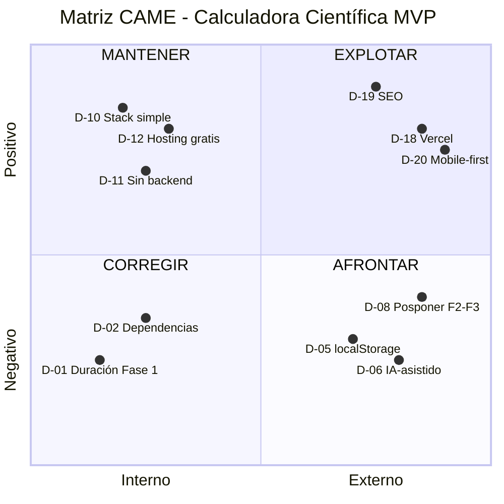

# 04_DECISIONES_CAME.md
## Decisiones Estratégicas - Análisis CAME

---

## Referencia

| Campo | Valor |
|-------|-------|
| **Documento Fuente** | 03_RIESGOS_OPORTUNIDADES.md |
| **Plan Maestro** | 02_MASTER_PLAN.md v1.3 |
| **Fecha de Análisis** | 2026-01-11 |
| **Metodología** | CAME (Corregir, Afrontar, Mantener, Explotar) |

---

## 1. Decisiones Estratégicas Derivadas del CAME

### CORREGIR (Debilidades internas a eliminar/mitigar)

| # | Decisión | Riesgo/Oportunidad | Tipo |
|---|----------|-------------------|------|
| D-01 | **Definir duración de Fase 1 como 2 semanas** dado el alcance limitado del MVP | R-06 | CORREGIR |
| D-02 | **Formalizar dependencias técnicas**: Solo navegador web moderno (Chrome, Firefox, Edge, Safari) | R-07 | CORREGIR |
| D-03 | **Documentar restricciones del proyecto**: Presupuesto $0, solo servicios gratuitos, código generado por IA | R-08 | CORREGIR |
| D-04 | **Documentar especificaciones de VM**: Solicitar al usuario clarificar proveedor y características si decide usarla | R-05 | CORREGIR |

### AFRONTAR (Amenazas externas a gestionar)

| # | Decisión | Riesgo/Oportunidad | Tipo |
|---|----------|-------------------|------|
| D-05 | **Aceptar limitación de localStorage** como solución de persistencia para MVP; sincronización entre dispositivos queda fuera de alcance | R-09, R-10 | AFRONTAR |
| D-06 | **Adoptar modelo IA-asistido** donde la IA genera 100% del código y el usuario supervisa/valida | R-01, R-02 | AFRONTAR |
| D-07 | **Restringir stack a opciones 100% gratuitas** sin excepciones | R-03, R-04 | AFRONTAR |
| D-08 | **Posponer fases 2 y 3** hasta validar MVP; no evaluar bibliotecas de gráficos ni bases de datos todavía | R-11, R-12 | AFRONTAR |
| D-09 | **Excluir funcionalidad de propina multi-país** del roadmap hasta definir fuente de datos | R-13 | AFRONTAR |

### MANTENER (Fortalezas a preservar)

| # | Decisión | Riesgo/Oportunidad | Tipo |
|---|----------|-------------------|------|
| D-10 | **Conservar stack HTML5/CSS3/JS Vanilla** sin frameworks adicionales | O-01 | MANTENER |
| D-11 | **Mantener arquitectura 100% frontend** sin backend para el MVP | O-02 | MANTENER |
| D-12 | **Preservar opciones de hosting gratuito** (GitHub Pages, Netlify, Vercel) | O-03 | MANTENER |
| D-13 | **Utilizar herramientas de desarrollo estándar** (VS Code, Live Server, Git/GitHub) | O-06, O-07 | MANTENER |
| D-14 | **Respetar priorización de requisitos** definida en Plan Maestro | O-12 | MANTENER |
| D-15 | **Mantener trazabilidad** requisitos → ideas origen | O-13 | MANTENER |
| D-16 | **Preservar modelo de desarrollo por fases** con entregas incrementales | O-11 | MANTENER |
| D-17 | **Garantizar ejecución de cálculos en cliente** sin dependencia de red | O-14 | MANTENER |

### EXPLOTAR (Ventajas a maximizar)

| # | Decisión | Riesgo/Oportunidad | Tipo |
|---|----------|-------------------|------|
| D-18 | **Seleccionar Vercel como plataforma de hosting** por previews automáticos y mejor DX | O-05, O-04 | EXPLOTAR |
| D-19 | **Implementar SEO desde el inicio** con meta tags, semántica HTML5 y estructura optimizada | O-08 | EXPLOTAR |
| D-20 | **Priorizar diseño mobile-first** en CSS | O-09 | EXPLOTAR |
| D-21 | **Reservar VM para entorno de pruebas** en caso de requerirse validación adicional | O-10 | EXPLOTAR |

---

## 2. Stack Tecnológico Seleccionado

### Frontend
| Tecnología | Versión/Detalle | Justificación |
|------------|-----------------|---------------|
| **HTML5** | Estándar actual | Estructura semántica, soporte universal, SEO-friendly |
| **CSS3** | Con CSS Variables | Diseño responsivo mobile-first, sin preprocesadores para simplificar |
| **JavaScript** | ES6+ Vanilla | Sin frameworks = menor complejidad, sin bundlers, compatible con nivel técnico del usuario |

### Persistencia
| Tecnología | Justificación |
|------------|---------------|
| **localStorage** | Solución nativa del navegador, sin costo, suficiente para historial local |

### Hosting y Despliegue
| Servicio | Justificación |
|----------|---------------|
| **Vercel** (Principal) | Plan gratuito, CI/CD automático, previews por PR, dominio gratuito `*.vercel.app` |
| **GitHub Pages** (Alternativa) | Backup si Vercel presenta limitaciones |

### Control de Versiones
| Herramienta | Justificación |
|-------------|---------------|
| **Git** | Estándar de la industria, trazabilidad completa |
| **GitHub** | Repositorio gratuito, integración con Vercel, documentación en mismo lugar |

### Desarrollo Local
| Herramienta | Justificación |
|-------------|---------------|
| **VS Code** | Editor gratuito, extensiones útiles, integración Git |
| **Live Server** (extensión) | Recarga automática, sin configuración |

### Lo que NO se incluye (y por qué)
| Tecnología | Razón de exclusión |
|------------|-------------------|
| React/Vue/Angular | Complejidad innecesaria para MVP + curva de aprendizaje |
| Node.js/Backend | Sin requisito funcional que lo justifique |
| Base de datos | localStorage suficiente; BD requerida solo en Fase 3 |
| TypeScript | Sobrecarga para proyecto simple |
| Sass/Less | CSS Vanilla suficiente para alcance actual |
| Testing frameworks | Validación manual suficiente para MVP |

---

## 3. Alcance de las Decisiones

### ✅ Lo que ESTÁ decidido

1. **Lenguajes y tecnologías**: HTML5, CSS3, JavaScript Vanilla ES6+
2. **Persistencia**: localStorage exclusivamente
3. **Hosting**: Vercel (primario), GitHub Pages (respaldo)
4. **Control de versiones**: Git + GitHub
5. **Modelo de desarrollo**: IA genera código, usuario supervisa
6. **Arquitectura**: 100% frontend, sin backend
7. **Enfoque de diseño**: Mobile-first, SEO integrado
8. **Duración Fase 1**: 2 semanas estimadas
9. **Fases 2 y 3**: Pospuestas hasta validar MVP

### ⏳ Lo que NO está decidido (queda para fases posteriores)

| Elemento | Fase de Decisión |
|----------|------------------|
| Biblioteca de graficación de funciones | Fase 3 |
| Motor matemático para derivadas/integrales | Fase 2 |
| Estructura de base de datos para unidades | Fase 3 |
| Fuente de datos para propina multi-país | Fase 3 |
| Uso específico de la máquina virtual | Cuando se requiera |
| Criterios de aceptación detallados por requisito | Inicio de Fase 1 |

---

## 4. Matriz CAME Resumen

---

## Control de Cambios

| Versión | Fecha | Descripción del Cambio |
|---------|-------|------------------------|
| 1.0 | 2026-01-11 | Creación inicial con 21 decisiones estratégicas derivadas del análisis CAME |

---
